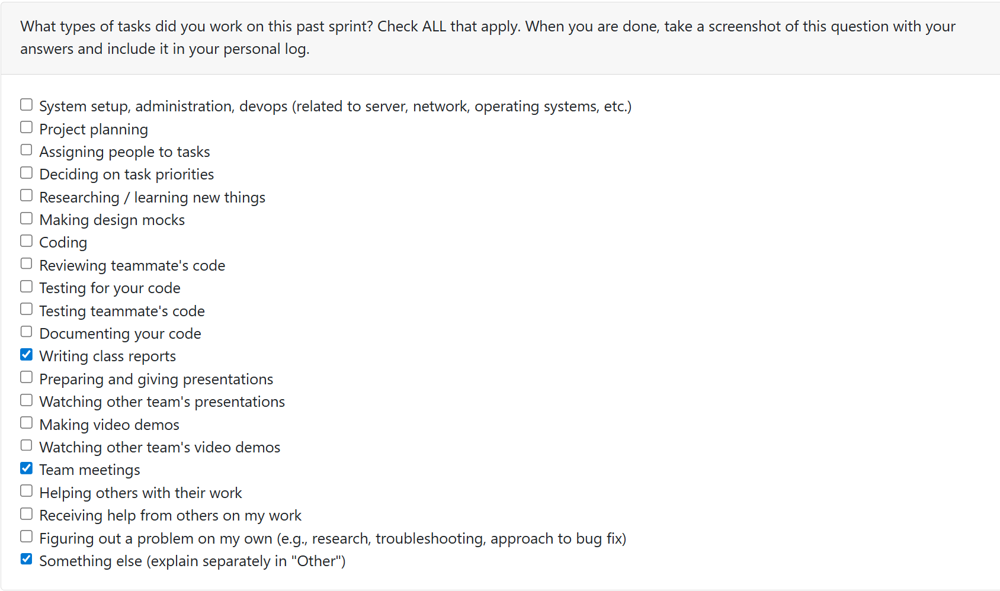

## Log 1:
## Date Range: Weeks 3 - Sept 15-21, 2025

## 

## Recap on your week's goals 

### Which features were yours in the project plan for this milestone?

This week we were working on our project requirements, since we had to submit them and bring printed copies to class. I focused on setting up our group by making a groupchat and google docs to ensure we were set up as a group, as well as the user stories. I also focused on setting up the git repository team/individual log folder.