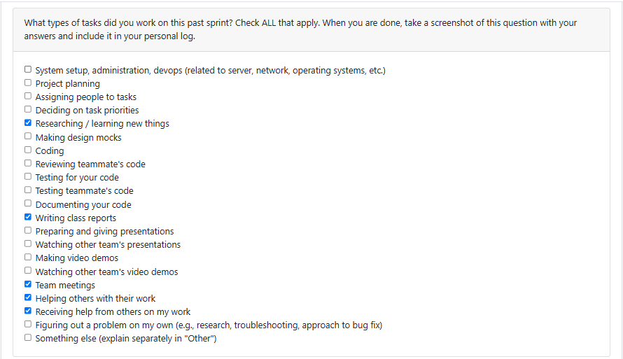

## Log 1:
## Date Range: Weeks 3 - Sept 15-21, 2025

## 

## Recap on your week's goals

During this period, our team discussed and refined the functional and non-functional requirements for the project. My personal focus was on researching similar projects online to better understand common requirements and best practices that could be relevant to our work. This helped me think critically about what features might be necessary and what constraints we should consider. My goals for the week were mainly to contribute to shaping our requirements document and ensure I had enough context to give meaningful input. 