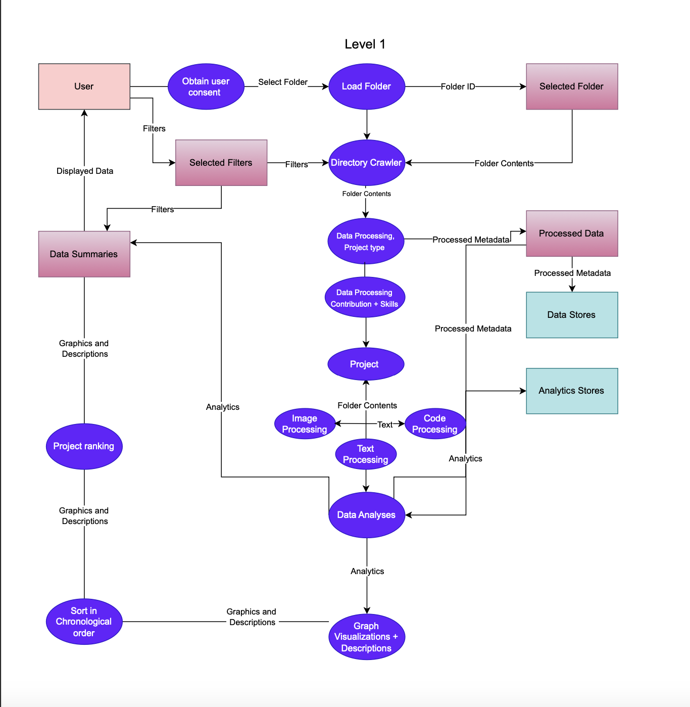

# Data Flow Diagram Level 1

The Data Flow Diagram outlines the processes in our system from beginning to end. The process begins with the user granting consent and selecting filters, which define the scope and type of data to be analyzed. Once the user selects a folder, the Directory Crawler scans its contents to identify relevant files, such as documents, code, images, and metadata. The retrieved data then flows into the data processing modules, where different types of content, image, text, and code, which are analyzed according to their specific formats.

During this stage, the system identifies project types, contributions, and associated skills, storing intermediate outputs as Processed Data and Processed Metadata in the Data Stores and Analytics Stores. These repositories support later retrieval and further statistical or comparative analysis.

Finally, the Data Analyses module integrates all processed information to generate summaries, and insights. The results are visualized through graphs, chronological sorting, and project rankings, which are presented to the user in clear graphical and descriptive formats.
