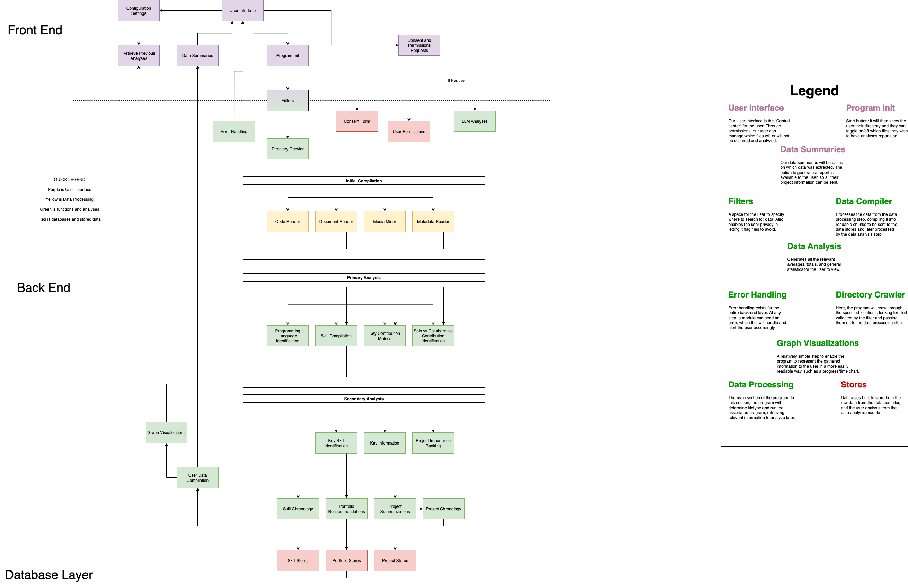

# System Architecture Diagram

Our system architecture diagram outlines a three-layer architecture including Front End, Back End, and a Database Layer, for a data analysis and visualization system.

Front End:
Handles user interaction, configuration, and permissions. The User Interface connects components like Program Init, and retrieving Data Summaries. It manages data filters, consent forms, and permission requests, ensuring privacy and ethical use.

Back End:
Performs the main data processing and analysis in three stages: 
Initial Compilation: gathers data from code, documents, media, and metadata.
Primary Analysis: identifies programming languages, skills, and contribution metrics.
Secondary Analysis: extracts key skills, project importance, and generates summaries, recommendations, and visualizations.

Database Layer:
Stores processed outputs, including Skill, Portfolio, and Project Stores, for retrieval and future analysis.

We also included a color legend:
Purple: Frontend / User Interface.
Green: Backend Functions and Analyses.
Red: Stored Data.
