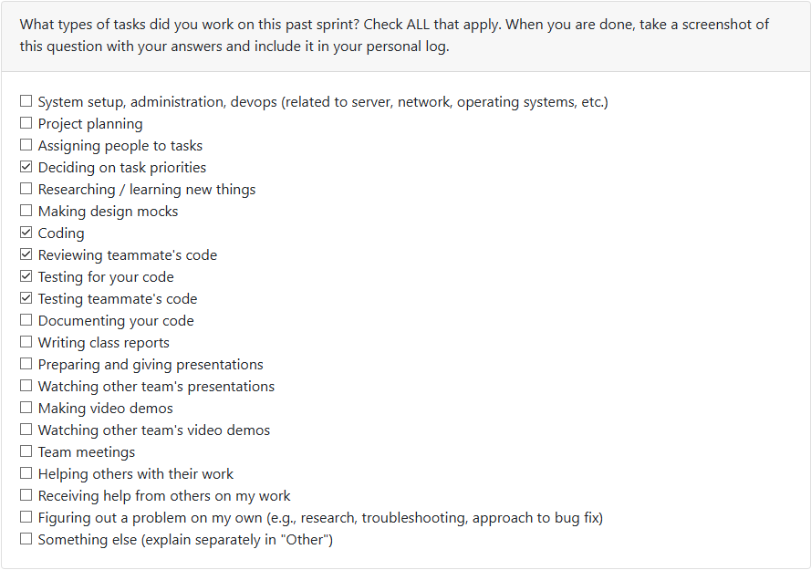
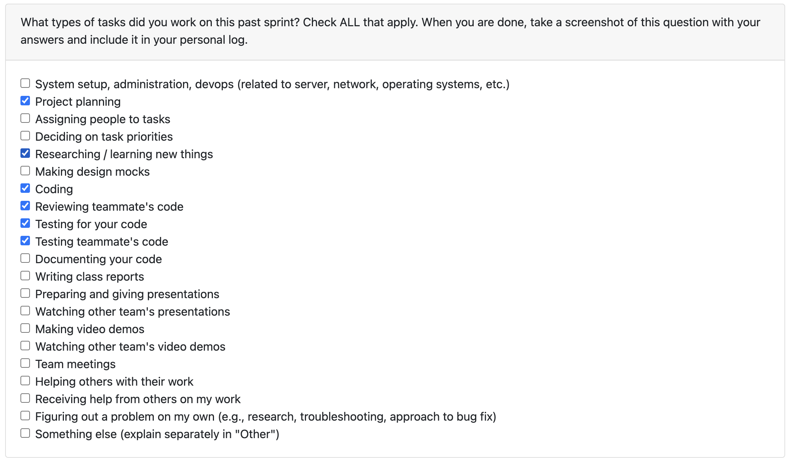
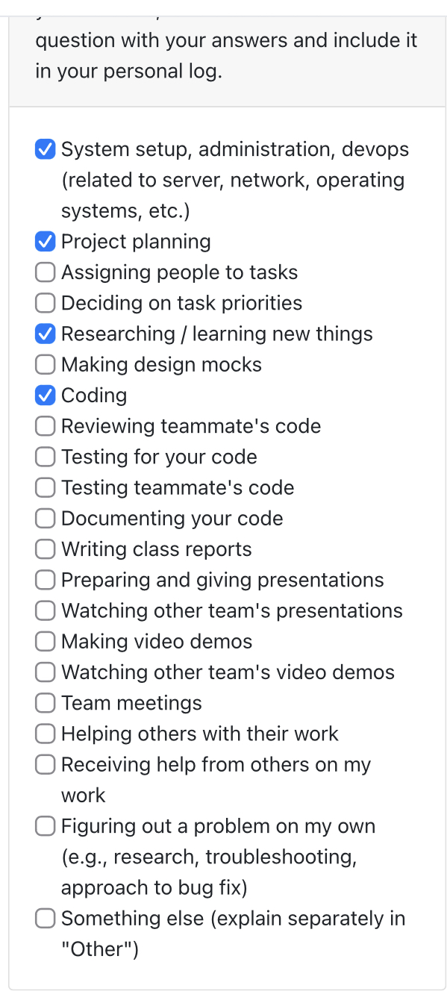
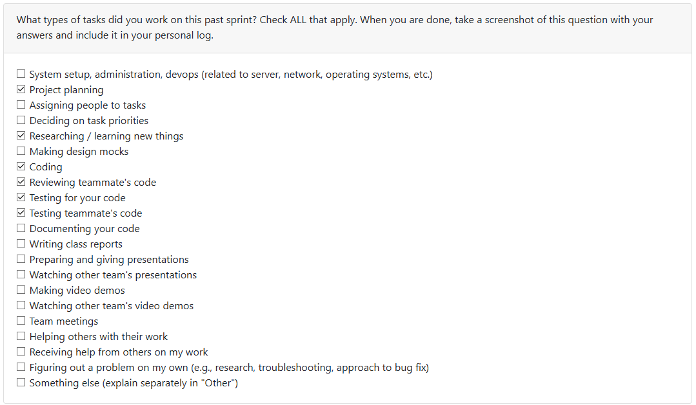
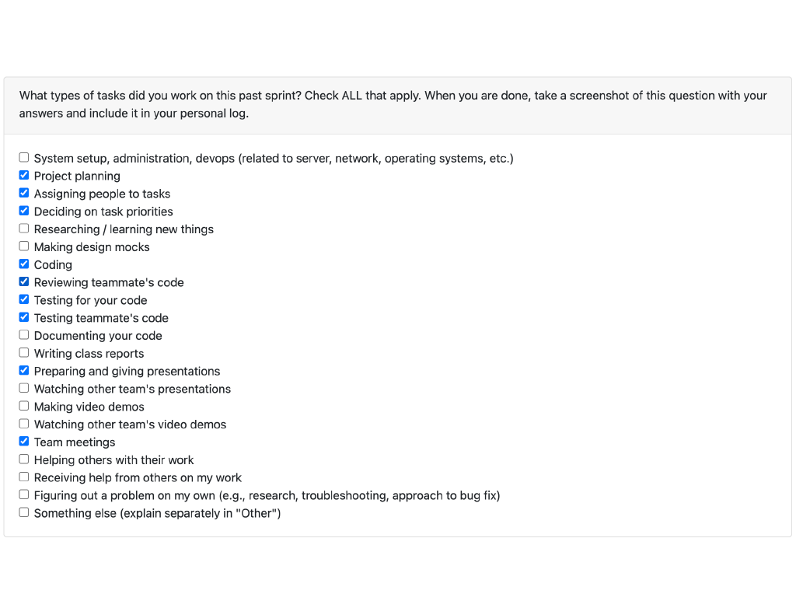
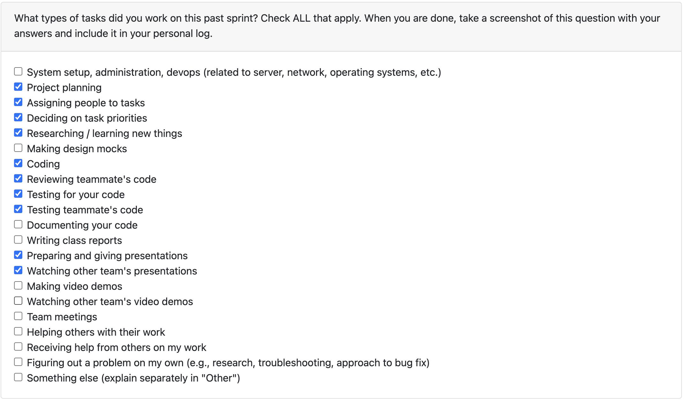
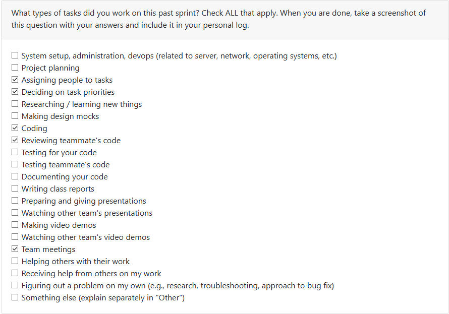

Personal Log (Expected Time: ~ 3 min)
- In repo as .md file
- Same file per person (append new entry to file)
- Expected content for each entry:
- Applicable date range
- Type of tasks you worked on (screenshot from Peer Eval question)
- Recap on your week's goals
- Which features were yours in the project plan for this milestone?
- Which tasks from the project board are associated with these features?
- Among these tasks, which have you completed/in progress in the last 2 weeks?
- Optional text: Additional context that we should be aware of

Hyperlinks for Term 2:
[Term 2 Week 1](#date-range-term-2-week-1---jan-4-jan-11-2025)
[Term 2 Week 2](#)
## Log 1:
## Date Range: Weeks 3 - Sept 15-21, 2025

## 

## Recap on your week's goals 

### Which features were yours in the project plan for this milestone?

There wasn't really enough to go off of in terms of
deliverables for the week. The team got together and 
all completed the quiz/assignment as well as the in class
exercises such as the functional requirements comparison 
in class.

## Log 2:
## Date Range: Weeks 4 - Sep 22-28, 2025

## 

## Recap on your week's goals 

### Which features were yours in the project plan for this milestone?

This week was primarily the System Architecture Diagram considering it was the focus of class with the exercise in which we compared with classmates. I created the revised version of the diagram after said class, cleaning up the looks and encompassing more of the project rather than the more streamlined list we had before. Outside of this, I contributed with the rest of the group to the project proposal, creating the use case diagram and providing input for the written content.

## Log 3:
## Date Range: Weeks 5 - Sep 29-Oct 5, 2025

## 

## Recap on your week's goals 

### Which features were yours in the project plan for this milestone?

This week the main deliverable was the DFD, once again the primary focus for the class where we shared with other groups. We had accidentally created two level 1 diagrams, as we split into 2 groups each to create one of the levels not being clear on what each entailed. We brought one copy into class for show, then realized the second version was a bit closer to what the description seemed to be asking for. Aside from this, we should soon be starting on setting up the framework for the project (which I believe we have agreed upon Electron) as well as other deliverables for the week. As for code contributions, we do not have our framework set up quite yet and I'm in the middle of midterms, so I don't have anything for this particular cycle. Over the next week and what should be before the next log cycle, I should have contributions being made.

## Log 4:
## Date Range: Weeks 6 - Oct 6-12, 2025

## 

## Recap on your week's goals 

### Which features were yours in the project plan for this milestone?

Here the main focus was getting code onto the repository. My responsibility was to make a rudimentary dashboard for us to start building functions off of. With this being thanksgiving weekend, that was all I was really able to get done for personal work. I also approved 1 PR and worked on revising the diagrams with the stated improvements.

## Log 5:
## Date Range: Weeks 7 - Oct13-19, 2025

## 

## Recap on your week's goals 

### Which features were yours in the project plan for this milestone?

My primary focus this week was getting some base level metrics in place to build off of for data analysis. To start, I used RAKE as well as code-to-text in order to create some basic keyword extraction. Now, when provided with text it will preform a RAKE evaluation and return keywords and scores attached to each. For code, it first scrapes for specifically comments and then conducts another RAKE evaluation with distinct stopwords this time. This wasn't any of the specific requirements, but I listed these as 12.1 and 12.2 as they are building blocks up to the larger issue. There are intentions to meet at some point this week to both assign priority ratings to issues as well as sub-issues to avoid this in the future.

## Log 6:
## Date Range: Weeks 8 - Oct20-26, 2025

## 

## Recap on your week's goals 

### Which features were yours in the project plan for this milestone?

This week was expanding on the comment keyword functionality. Also to note, it looks like the work falls into monday to sunday as the date range and the PR I had for the code keyword extraction falls into that date range this week, not last week, hence why I had less work for week 7. So on top of keywords extraction from comments, I now have two forms of evaluation. First compares the total score (combination of quality and quantity) of keywords in relation to the file size, giving a score on the technical density of a file. For the other metric, I evaluate what categories the comments talk about. This alone isn't a metric, but as I described in its PR, it is designed to be used with what was a pending PR that evaluates skills used within a file. It will compare the commented skills to the used skills to see what percentage of the document is explained in the comments. The plan is to take one more metric and then create a sort of "comprehension score" that we will later use as a factor in evaluating the total score of a specific file. The goal is to use these total scores to evaluate the total quality of files and further projects so we have a ranking in place before potentially doing further analysis with an LLM. 

## Log 7:
## Date Range: Weeks 9 - Oct27-Nov2, 2025

## 

Please note that at the time of creation, the weekly quiz is not available so I cannot provide the screenshot of the checklist for now.

## Recap on your week's goals 

### Which features were yours in the project plan for this milestone?

This week started off with polishing off how our repository handles tests. We were at a point where people were using both pytest and unittest and it got a little annoying to test the repository as a whole. So early in the week I worked on getting all of the tests into one unittest format where a single line of code can run all tests and confirm the entire system is working properly. Past that, I finalized my work on comprehension scores. I took the metrics I had created before (with a few more tweaks) and got it to a point I have a percentage score on the user's comprehension and documentation of a file based on how well the comments are formatted. The formula has 80% of the weight on wether or not the comments reflect the categories retrieved by the skills extraction module and 20% on the sheer quantity of the code in comparison to the file size. My intent was to put emphasis on quality over quantity by emphasizing wether identified skills are actually adressed, but not completely ignore quantity as that would at least allow some weight for the unidentified skills to have a pull on the final result.

## Log 8:
## Date Range: Weeks 10 - Nov3-9, 2025

## 

## Recap on your week's goals 

### Which features were yours in the project plan for this milestone?

unfortunately this week lined up with a handful of other projects and midterms so I wasn't able to contribute as much as I'd have liked to the project this week. I did some housekeeping earlier with getting dependencies set up, but wasn't able to get any PRs up before Friday as I was leaving and unable to do work past the date. It was something I'd warned the team about prior and plan o. picking up the slack once back in Kelowna.

## Log 9:
## Date Range: Week 12 - Nov 17-23, 2025

## 

## Recap on your week's goals 

### Which features were yours in the project plan for this milestone?

This week was first week back from reading break. My main focus for this week was getting the ranking scores (importance scores) in place for the database. There was a fair bit of work off-repository to try and figure out how to properly weigh things in a way that the final score would most accurately reflect the quality of a project. As of right now, I've split them into four categories, each with weights. I put most of the weight onto metadata seeing as this is supposed to be a resume tool as the category covered skills and languages used.

## Log 10:
## Date Range: Week 13 - Nov 24-30, 2025

## 

## Recap on your week's goals 

### Which features were yours in the project plan for this milestone?

This week was a significant amount of work outside of the actual repository. Getting the presentation together as well as divvying up what work was remaining to ensure that we were ending the last week of classes in good form. During this, we came to the agreement that we could use some more non-llm analysis for our projects. Because of this, I began work on a module to evaluate the efficiency of a specific code file. It determines the language of the file and runs it through evaluation functions based on the syntax of the language. It will return scores for the storage complexity and time complexity and further an overall efficiency score (Putting higher weight on time complexity). As of right now, only the functions really exist for this evaluation to be done on a singular file. As it stands it is more of a proof of concept versus a full implementation for what we need, but the next steps won't be especially hard. Aside from this, I had a couple PRs of 1-30 lines each just finishing minor functions and polishing where I can. 

### Plans for next week

This next week is presentation week so as far as work to complete, I will likely step back and let those with functions that need polishing to finish up. If I have the time, I may tackle fully implementing efficiency, but as it stands I'll put my effort into the final presentation and offering whatever help I can. 
Outside of this, it was a little hard to get momentum going again coming back from reading break, but I think the team did a pretty good job. We were missing a good chunk at the check-in but with communication through our chats I feel we are still on good pace to finish what is needed before milestone 1. 

This next week I'd imagine will be a lot of scrap cleaning across the board. Our kanban board has a handful of tasks still to be completed so leading up to the milestone due date we will be meeting after Monday's class to divide up the work as best we can. 

## Log 11:
## Date Range: Week 14 - Nov 30-Dec 7, 2025

## 

## Recap on your week's goals 

### Which features were yours in the project plan for this milestone?

This week was mostly polishing things off for the Milstone 1 submission. The group as a whole worked on fixing the issues we had with tests, refactoring main.py to run smoother, and fixing any other last minute issues we came across. Personally, I wrapped up the other half of the code efficiency module I was working on, enabling a full folder to be submitted and to provide the user with an aggregate score for the files within as well as giving a progress bar so larger projects don't just look like a freeze. I didn't have a specific issue for this, as it was a non-requirement feature we decided to add last minute to provide more non-LLM analyses to the user. As for the video for our team, we struggled to complete it together as we ran into bugs that weren't allowing us to record properly. With everyone having exams very soon and not wanting to allocate more time than they had to into the video, I just decided to take it all upon myself so we could move on with our days. 

### Plans for next week

Christmas shopping I guess? Coming back from the break I assume there will be a meeting discussing next steps, and if I find myself with spare time I may pick up some non-consequential module that won't require too much input from others as I imagine communication may be spotty over the break. 

## Log 12:
## Date Range: Term 2 Week 1 - Jan 4-Jan 11, 2025

## 

## Recap on your week's goals 

### Which features were yours in the project plan for this milestone?

This week was listed as bonus so I did not get around to working on it this week.

### Plans for next week

Fixing missed components from M1 and further development

## Log 13:
## Date Range: Term 2 Week 2 - Jan 12-Jan 18, 2025

## 

## Recap on your week's goals 

### Which features were yours in the project plan for this milestone?

With peer reviews on the horizon, I figured the current status of our main navigation wasn't really acceptable. To fix this in PR 242, I reworked the menu into three submenus so the user isn't overwhelmed by the 14ish we had before. This was mostly refactoring existing code as it was just reorganizing things a little cleaner. Aside from that, I reviewed PR 238 which was fixing an issue with our configurations that we missed in milestone 1. It was technically fine but I felt it was still prompting the user too much, so I left a suggestion but approved it anyways as it is still functionally fine. By the nature of both of these, there weren't really any tests involved for either, nor were they collaborative. 

### Plans for next week

I've currently listed myself for issue 222 (issue 24 if you go by titles) where we want to incorporate a key role of the user in a given project. At the bare minimum, this will be a prompt that comes after analyzing and identifying a project as collaborative, allowing the user to specify their title in the work. Once this is complete, I'd like to try implementing role identification. I'm unsure how I'd implement this yet, perhaps by creating a list of possible role descriptions based on the work supplied to choose from? Either way, that's my plans for this upcoming week in terms of coding. There will still be the regular team meetings as well as picking up work to prep for peer testing as well. 
