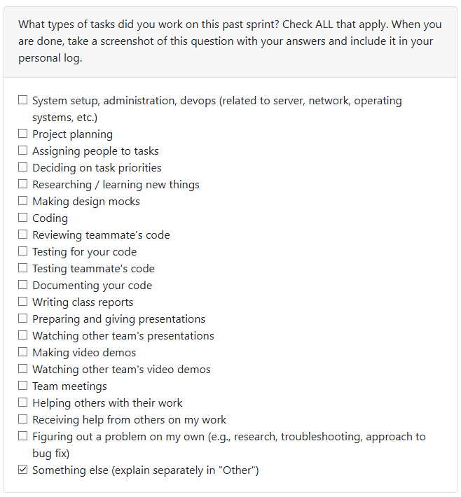
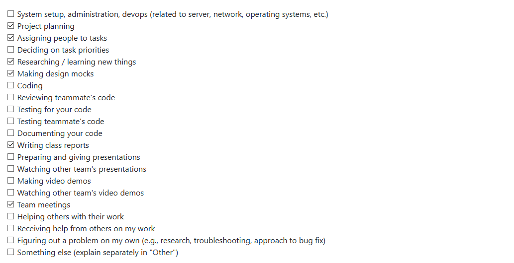
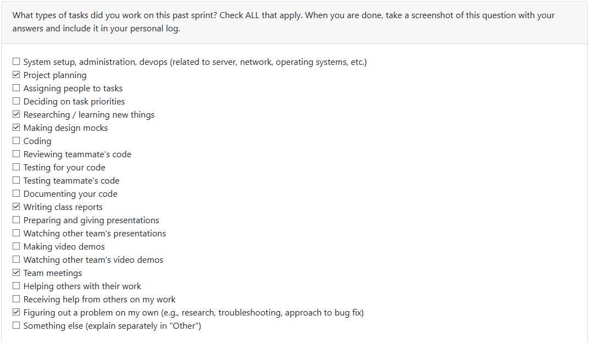
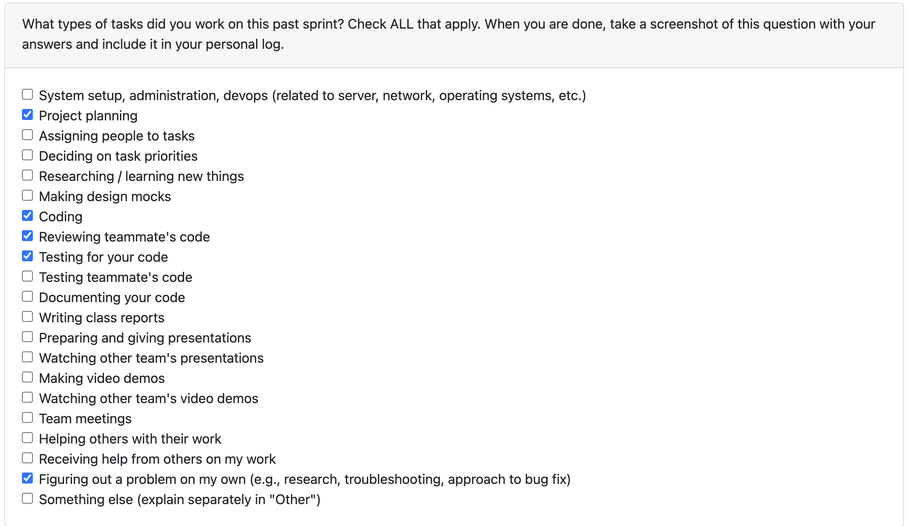

Personal Log (Expected Time: ~ 3 min)
- In repo as .md file
- Same file per person (append new entry to file)
- Expected content for each entry:
- Applicable date range
- Type of tasks you worked on (screenshot from Peer Eval question)
- Recap on your week's goals
- Which features were yours in the project plan for this milestone?
- Which tasks from the project board are associated with these features?
- Among these tasks, which have you completed/in progress in the last 2 weeks?
- Optional text: Additional context that we should be aware of
## Log 1:
## Date Range: Weeks 3 - Sept 15-21, 2025

## 

## Recap on your week's goals 

### Which features were yours in the project plan for this milestone?

There wasn't really enough to go off of in terms of
deliverables for the week. The team got together and 
all completed the quiz/assignment as well as the in class
exercises such as the functional requirements comparison 
in class.

## Log 2:
## Date Range: Weeks 4 - Sep 22-28, 2025

## 

## Recap on your week's goals 

### Which features were yours in the project plan for this milestone?

This week was primarily the System Architecture Diagram considering it was the focus of class with the exercise in which we compared with classmates. I created the revised version of the diagram after said class, cleaning up the looks and encompassing more of the project rather than the more streamlined list we had before. Outside of this, I contributed with the rest of the group to the project proposal, creating the use case diagram and providing input for the written content.

## Log 3:
## Date Range: Weeks 4 - Sep 29-Oct 5, 2025

## 

## Recap on your week's goals 

### Which features were yours in the project plan for this milestone?

This week the main deliverable was the DFD, once again the primary focus for the class where we shared with other groups. We had accidentally created two level 1 diagrams, as we split into 2 groups each to create one of the levels not being clear on what each entailed. We brought one copy into class for show, then realized the second version was a bit closer to what the description seemed to be asking for. Aside from this, we should soon be starting on setting up the framework for the project (which I believe we have agreed upon Electron) as well as other deliverables for the week. As for code contributions, we do not have our framework set up quite yet and I'm in the middle of midterms, so I don't have anything for this particular cycle. Over the next week and what should be before the next log cycle, I should have contributions being made.

## Log 4:
## Date Range: Weeks 5 - Oct 6-12, 2025

## 

## Recap on your week's goals 

### Which features were yours in the project plan for this milestone?

Here the main focus was getting code onto the repository. My responsibility was to make a rudimentary dashboard for us to start building functions off of. With this being thanksgiving weekend, that was all I was really able to get done for personal work. I also approved 1 PR and worked on revising the diagrams with the stated improvements.

