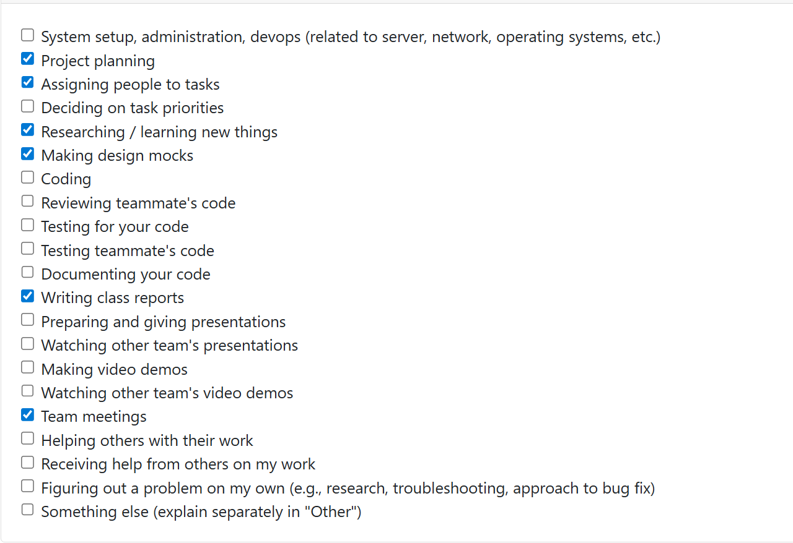
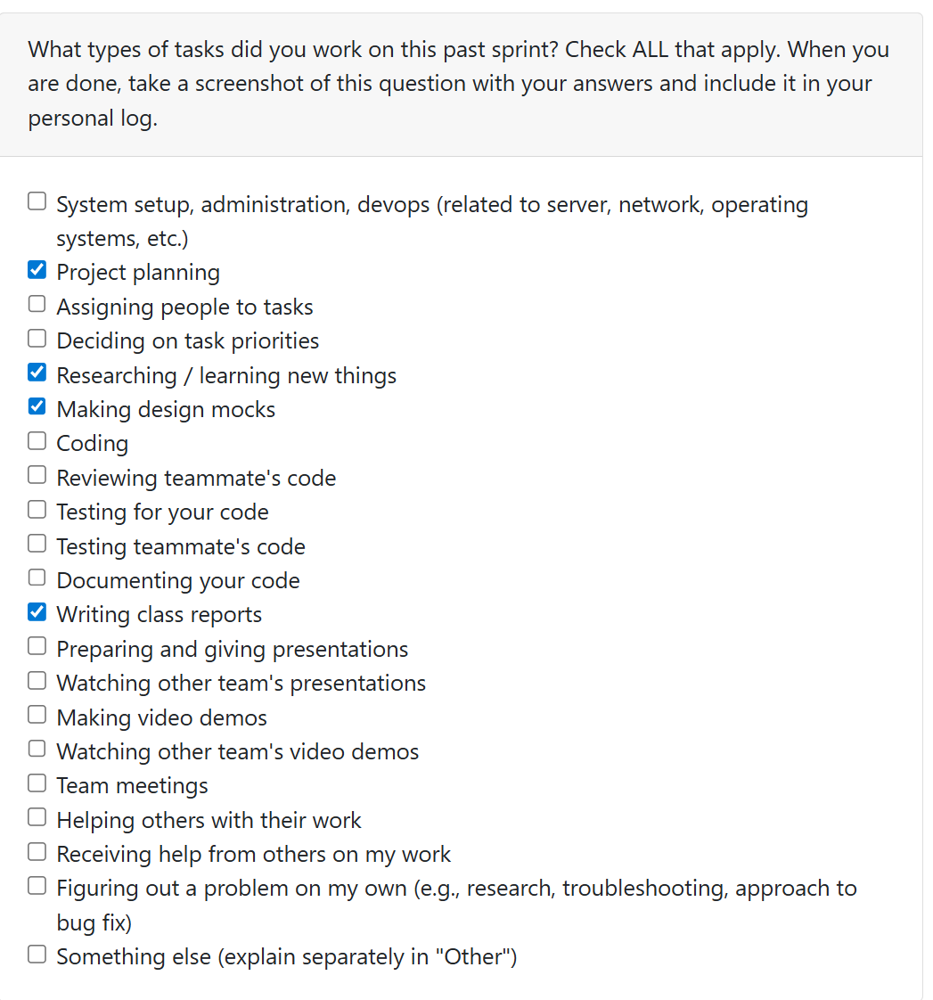
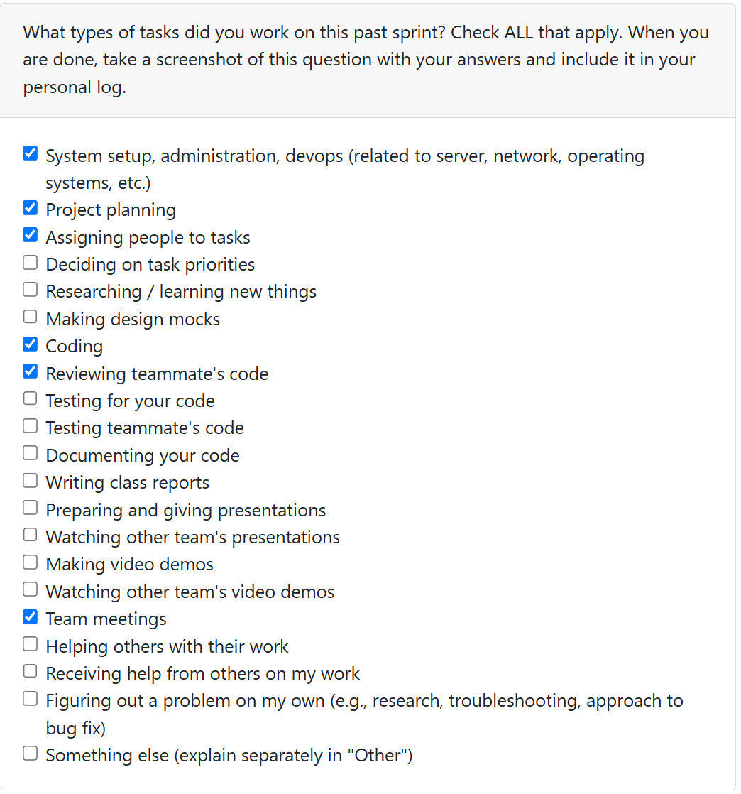

Personal Log (Expected Time: ~ 3 min)
- In repo as .md file
- Same file per person (append new entry to file)
- Expected content for each entry:
- Applicable date range
- Type of tasks you worked on (screenshot from Peer Eval question)
- Recap on your week's goals
- Which features were yours in the project plan for this milestone?
- Which tasks from the project board are associated with these features?
- Among these tasks, which have you completed/in progress in the last 2 weeks?
- Optional text: Additional context that we should be aware of
## Log 1:
## Date Range: Weeks 3 - Sept 15-21, 2025

## 

## Recap on your week's goals 

### Which features were yours in the project plan for this milestone?

This week we were working on our project requirements, since we had to submit them and bring printed copies to class. I focused on setting up our group by making a groupchat and google docs to ensure we were set up as a group, as well as the user stories. I also focused on setting up the git repository team/individual log folder.

## Log 2:
## Date Range: Weeks 4 - Sep 22-28, 2025

## 

## Recap on your week's goals 

### Which features were yours in the project plan for this milestone?

This week our main focus was completing the System Architecture Diagram, as we were required to submit and bring printed copies to class for discussion. I focused on refining the diagram to ensure it aligned with the System Architecture Design Checklist, making sure all requirements were clearly addressed. As well, I contributed to the Project Proposal by researching and evaluating different technology stack options to determine the best fit for our project.

## Log 3:
## Date Range: Weeks 5 - Sep 29-Oct 05, 2025

## 

## Recap on your week's goals 

### Which features were yours in the project plan for this milestone?

This week our main focus was completing the DFD , as we were required to submit and bring printed copies to class for discussion. We split the group into two, and I worked on the DFD level 0 diagram with Jackson and Tolu, while Prina, Illina, and Sana worked on Level 1. This week's workload was fairly light, as only the DFD was due, and so not much work was done this week. However, I also ensured that my group was keeping on top of deadlines, and organizing meetups to ensure work on the project is done.

## Log 3:
## Date Range: Weeks 6 - Oct 06-12, 2025

## 

## Recap on your week's goals 

### Which features were yours in the project plan for this milestone?

Our goals this week was to update our DFD, System Architecture Diagram, and the Project Board on Github with up-to-date tasks from the Milestone 1 requirements, as well as completing some coding + PRs. 
On Monday we met as a group, and discussed how the week would go + created group roles (who would take minutes, who would ensure that we are on track, who would take lead in meetings, etc.). On Wednesday, Prina and I assigned the tasks on the Github Project Board so that everything was clear, and we would know where + what to start with. On Friday, Illina, Sana, and I met to work on getting the project started. I worked on the Format File Checker function. Then, we each completed our PRs, and Illina and I worked on fixing the merge conflicts so that main was up-to-date for the other half of our team. I worked on Issue 3:   [COSC-499-W2025/capstone-project-team-13#10](https://github.com/COSC-499-W2025/capstone-project-team-13/issues/10)

This task is now In-Progress, as I want to ensure it meets full working compatibility with main before I move it to "done". 