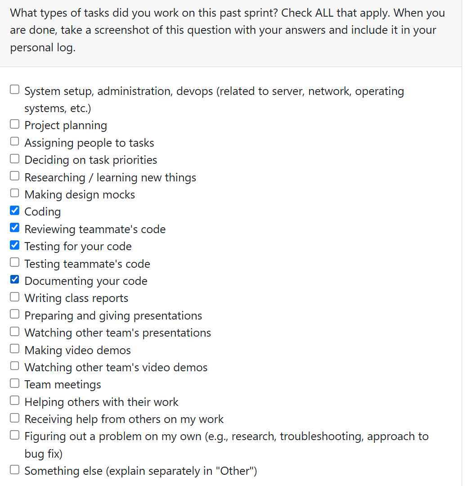
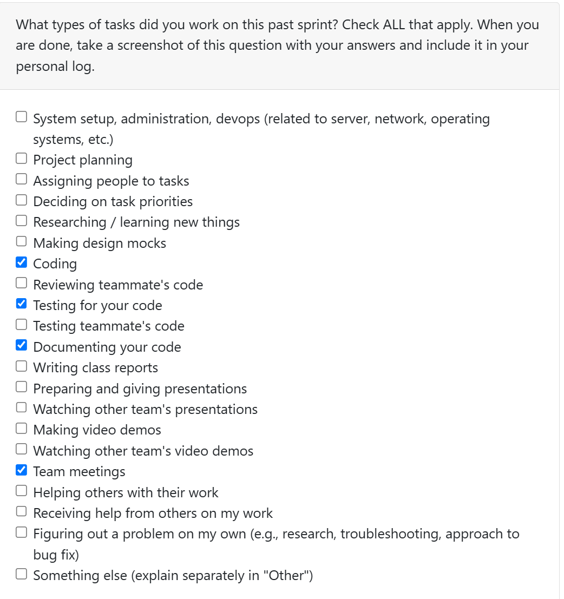
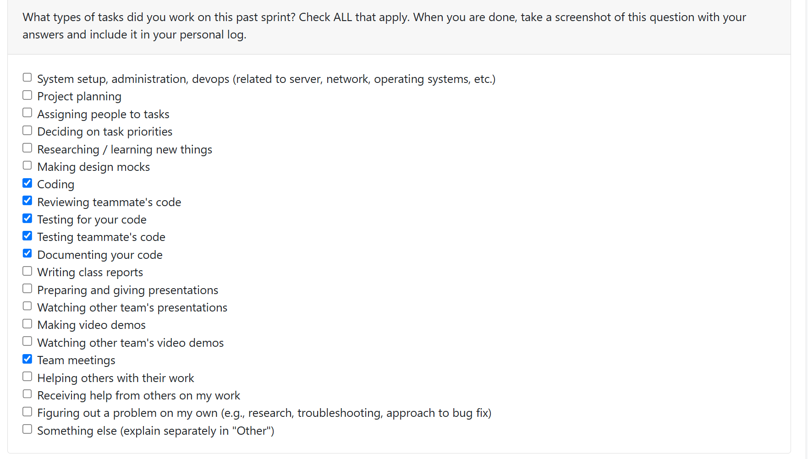

Personal Log (Expected Time: ~ 3 min)
- In repo as .md file
- Same file per person (append new entry to file)
- Expected content for each entry:
- Applicable date range
- Type of tasks you worked on (screenshot from Peer Eval question)
- Recap on your week's goals
- Which features were yours in the project plan for this milestone?
- Which tasks from the project board are associated with these features?
- Among these tasks, which have you completed/in progress in the last 2 weeks?
- Optional text: Additional context that we should be aware of
## Log 1:
## Date Range: Weeks 3 - Sept 15-21, 2025

## 

## Recap on your week's goals 

### Which features were yours in the project plan for this milestone?

This week we were working on our project requirements, since we had to submit them and bring printed copies to class. I focused on setting up our group by making a groupchat and google docs to ensure we were set up as a group, as well as the user stories. I also focused on setting up the git repository team/individual log folder.

## Log 2:
## Date Range: Weeks 4 - Sep 22-28, 2025

## 

## Recap on your week's goals 

### Which features were yours in the project plan for this milestone?

This week our main focus was completing the System Architecture Diagram, as we were required to submit and bring printed copies to class for discussion. I focused on refining the diagram to ensure it aligned with the System Architecture Design Checklist, making sure all requirements were clearly addressed. As well, I contributed to the Project Proposal by researching and evaluating different technology stack options to determine the best fit for our project.

## Log 3:
## Date Range: Weeks 5 - Sep 29-Oct 05, 2025

## 

## Recap on your week's goals 

### Which features were yours in the project plan for this milestone?

This week our main focus was completing the DFD , as we were required to submit and bring printed copies to class for discussion. We split the group into two, and I worked on the DFD level 0 diagram with Jackson and Tolu, while Prina, Illina, and Sana worked on Level 1. This week's workload was fairly light, as only the DFD was due, and so not much work was done this week. However, I also ensured that my group was keeping on top of deadlines, and organizing meetups to ensure work on the project is done.

## Log 4:
## Date Range: Weeks 6 - Oct 06-12, 2025

## 

## Recap on your week's goals 

### Which features were yours in the project plan for this milestone?

Our goals this week was to update our DFD, System Architecture Diagram, and the Project Board on Github with up-to-date tasks from the Milestone 1 requirements, as well as completing some coding + PRs. 
On Monday we met as a group, and discussed how the week would go + created group roles (who would take minutes, who would ensure that we are on track, who would take lead in meetings, etc.). On Wednesday, Prina and I assigned the tasks on the Github Project Board so that everything was clear, and we would know where + what to start with. On Friday, Illina, Sana, and I met to work on getting the project started. I worked on the Format File Checker function. Then, we each completed our PRs, and Illina and I worked on fixing the merge conflicts so that main was up-to-date for the other half of our team. I worked on Issue 3:   [COSC-499-W2025/capstone-project-team-13#10](https://github.com/COSC-499-W2025/capstone-project-team-13/issues/10)

This task is now In-Progress, as I want to ensure it meets full working compatibility with main before I move it to "done". 

## Log 5:
## Date Range: Weeks 7 - Oct 13-19, 2025

## 

## Recap on your week's goals 

### Which features were yours in the project plan for this milestone?
I focused on issue #8

This week we had to prep for the quiz, so Monday was used for preparation. Wednesday was the quiz, and we had a small group meeting. I met some challenges, as my water bottle spilled in my bag and I had to ensure my comptuer was properly dry before working, so that took 48 hours of drying which meant I could not code from Thursday evening until Saturday evening. However, I completed my code, and reviewed a PR. 

My feature was a function that determined the language and framework used in a coding project, this was associated with Issue #8: https://github.com/COSC-499-W2025/capstone-project-team-13/issues/15
I also created tests to ensure this function would work appropriately.

This task has now been moved to "done" on the project board, as it has been tested and is ready for implementation.

For the next cycle, I think a team meeting needs to be held so we can decide on next individual steps. I believe after that, a specific task of mine will be clearer based on the needs of the project. Until then, I plan to work on some analyses (such as issue #5) or work on the database (issue #13)

## Log 6:
## Date Range: Weeks 8 - Oct 20-26, 2025

## 
## Recap on your week's goals 

### Which features were yours in the project plan for this milestone?
I focused on issue #8.2, which was a subissue to the task I worked on last week

This week, after discussion with the Professor on Wednesday, I decided that instead of working on the backend it was important to ensure that the extension of the file matched the content of the file. I decided to make 2 functions, one that would determine its extension, and another that would sniff the content of the file to classify it. I tested this function, and added it to our pipeline on main, so that it is ready for use.

My feature was a function that determined if the content and the extension matched, which was a subissue of issue #8: 
https://github.com/COSC-499-W2025/capstone-project-team-13/issues/80

I also created tests to ensure this function would work appropriately.

This task has now been moved to "in review" on the project board, as it has been tested and is ready for implementation.

For the next cycle, I want to focus on more analyses or on the backend, so this would be issue #6 or #5.

## Log 7:
## Date Range: Weeks 9 - Oct 27-Nov 02, 2025

## 
The peer evaluations were not open so I could not complete them

## Recap on your week's goals 
### Which features were yours in the project plan for this milestone?
I focused on issue #13, as there are 3 parts to this issue. Last week Illina worked on the codingProjectScanner, but we still needed 2 more scanners. I handled the textDocumentScanner portion of this issue.

This week, I worked on the textDocumentScanner. I was working on it before the textSkillsExtractor was pulled to main, so I will need to implement that and update the Scanner within the following sprint. This sprint I tested my scanner, and ensured it was working so that it can be implemented to the pipeline.

My feature uses the previously created functions and added them all to one area so that when there is a text file needing to be scanned the analysis can be performed fully with the scanner: https://github.com/COSC-499-W2025/capstone-project-team-13/issues/20

I also created tests to ensure this scanner worked appropriately.

This task is in progress as there are 3 components to it, but after updating it in the following sprint it will be moved to Done.

For the next cycle, a team-meeting will be held so we can decide what is most pressing in the group and what has to be accomplished before reading break. I will most likely work on an issue such as issue [COSC-499-W2025/capstone-project-team-13#17](https://github.com/COSC-499-W2025/capstone-project-team-13/issues/17)

# Log 8:
## Date Range: Weeks 10 - Nov 03-Nov 09, 2025

## 
The peer evaluations were not open so I could not complete them

## Recap on your week's goals 
### Which features were yours in the project plan for this milestone?
I focused on issue #13 again, as the previous week I was not able to fully finish all the implementation due to the fact that I had begun working on it before the skills analyzer was pulled to main. Now it is ingrated and can be used.

This week, I worked on the above and updated the test to ensure the skills analyzer was working.

My feature uses the previously created functions and added them all to one area so that when there is a text file needing to be scanned the analysis can be performed fully with the scanner: https://github.com/COSC-499-W2025/capstone-project-team-13/issues/20

This task is in progress as there are 3 components to it, but now that it is updated it should be moved to DONE.

For the next cycle, a team-meeting will be held so we can decide what is most pressing in the group and what has to be accomplished before the demo deadline. Most likely [COSC-499-W2025/capstone-project-team-13#17](https://github.com/COSC-499-W2025/capstone-project-team-13/issues/17)
