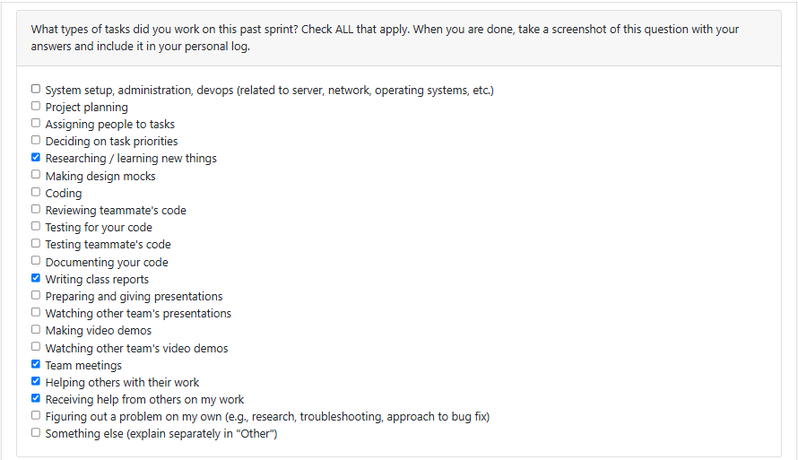
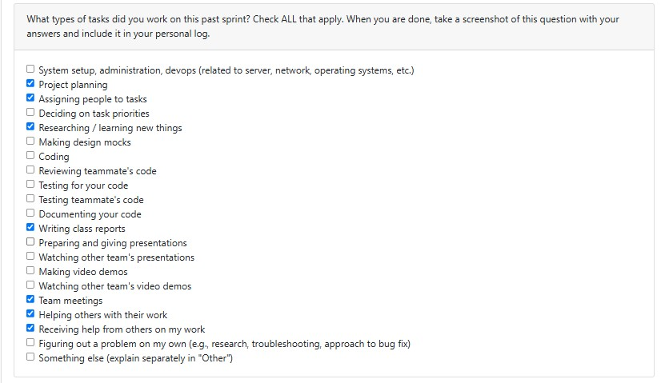
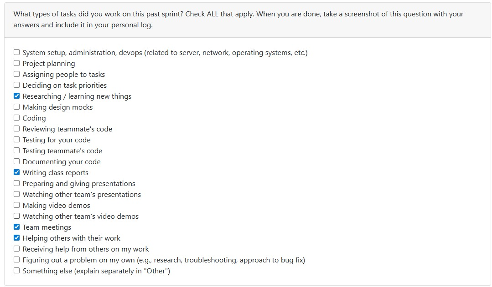
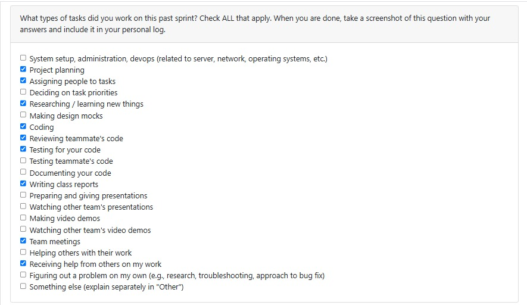
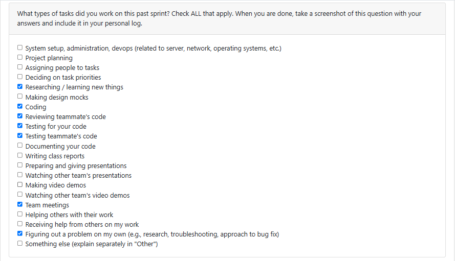
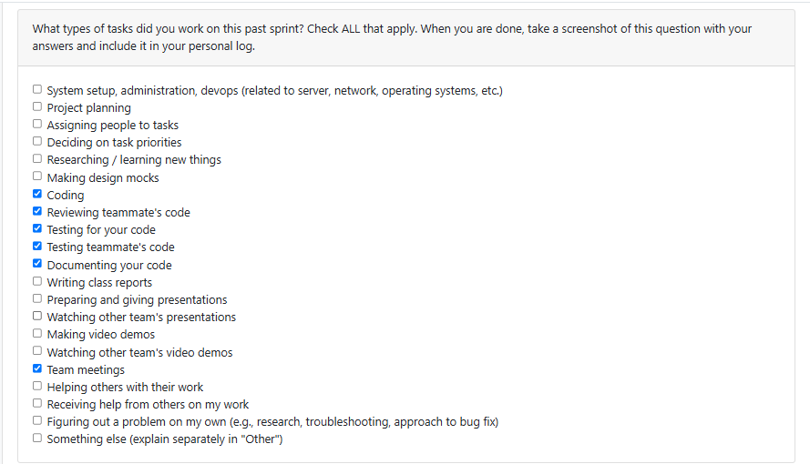
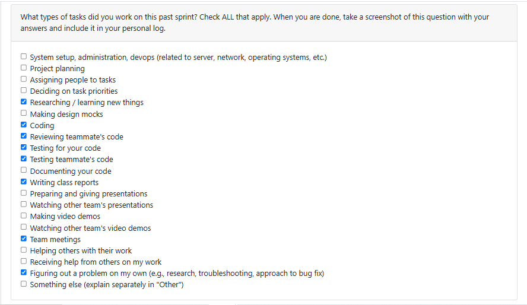

## Log 1:
## Date Range: Weeks 3 - Sept 15-21, 2025

## 

## Recap on your week's goals

During this period, our team discussed and refined the functional and non-functional requirements for the project. My personal focus was on researching similar projects online to better understand common requirements and best practices that could be relevant to our work. This helped me think critically about what features might be necessary and what constraints we should consider. My goals for the week were mainly to contribute to shaping our requirements document and ensure I had enough context to give meaningful input. 

## Log 2:
## Date Range: Week 4 - Sept 22-28, 2025

## 

## Recap on your week's goals

This week, I worked closely with my team on building the system architecture and developing the project proposal. My main contributions included identifying and listing all the use cases for our system, as well as creating the workload distribution table to ensure tasks were divided fairly and efficiently among team members. I also took part in every team meeting, where I actively contributed to discussions, shared ideas, and provided feedback.

## Log 3:
## Date Range: Week 5 - Sept 29-Oct 5, 2025

## 

## Recap on your week's goals

This week, I helped design the Data Flow Diagram by creating the processes and mapping out how data moves between them. I worked on building the diagram in Figma, making sure it was clear, well-organized, and visually consistent with our project standards.

## Log 4:
## Date Range: Week 5 - Oct 5 - Oct 12, 2025

## 

## Recap on your week's goals

This week, I updated the Kanban board and, together with Maya, assigned tasks to everyone in the group. I also attended the team meeting on Monday. On the development side, I added a zip file handler and created as well as reviewed and approved pull requests on GitHub. I also researched which frameworks would be best suited for our project.

## Log 5:
## Date Range: Week 5 - Oct 13 - Oct 19, 2025

## 

## Recap on your week's goals

This week, I worked on issue #2 on the Kanban board. I focused on building the feature that prompts users to enter a file path and then processes the file based on its format. The system can now handle multiple file types including `.csv`, `.json`, `.txt`, `.py`, and `.zip`. It also automatically performs the correct parsing or reading operations for each. Additionally, I implemented detailed error handling to manage invalid inputs and potential edge cases, along with unit tests to verify that the feature behaves reliably across scenarios. For next week, I plan to implement functionality for storing user configurations and start analyzing project files to extract useful insights and support upcoming features.

## Log 6:
## Date Range: Week 6 - Oct 20 - Oct 26, 2025

## 

## Recap on your week's goals

### What I Worked On This Week
This week, I completed a major database refactor. I expanded the Project model with 15+ new fields (importance scoring, featured flags, skills/tags, user customization), enhanced the File and Contributor models with additional metadata and contribution tracking, and introduced a new Keyword model for skill extraction. I also added thorough test coverage for all changes.

### Plan for Next Week
Next week, I will research AI/LLM integration opportunities for our system, focusing on how we can use AI-driven analysis in our artifact mining workflow while preserving user privacy and consent.

## Log 7:
## Date Range: Week 6 - Oct 27 - Nov 2, 2025

## 

## Recap on your week's goals

### What I Worked On This Week
This week, I focused on implementing the basic AI integration for our system through the Google Gemini 2.5 Flash API, emphasizing cost optimization and performance monitoring. I successfully integrated rate limiting, response caching, cost tracking and usage monitoring features, along with a console dashboard for better visibility and management (https://github.com/COSC-499-W2025/capstone-project-team-13/issues/97). In addition, I developed a comprehensive test suite to ensure the reliability of the AI functionality. Alongside this, I rewrote the "main.py" file to implement a more complete project analysis pipeline - adding consent checks, file format validation, project duplication handling, database integration, and dynamic routing to analyzers based on content type (code, text, or media). This overhaul was aimed at improving the overall user experience and laying a stronger foundation for future AI-driven features (https://github.com/COSC-499-W2025/capstone-project-team-13/issues/110).

### Plan for Next Week
Next week, my goal is to build upon the current AI foundation and implement AI-generated project descriptions and enhance the existing "summarizeProjects.py" (https://github.com/COSC-499-W2025/capstone-project-team-13/issues/111). On the content generation side, I will work on developing professional project descriptions, resume bullet points, and skill highlight summaries using template-based prompt engineering for consistency (https://github.com/COSC-499-W2025/capstone-project-team-13/issues/112).    
