## Log 1:
## Date Range: Weeks 3 - Sept 15-21, 2025

## 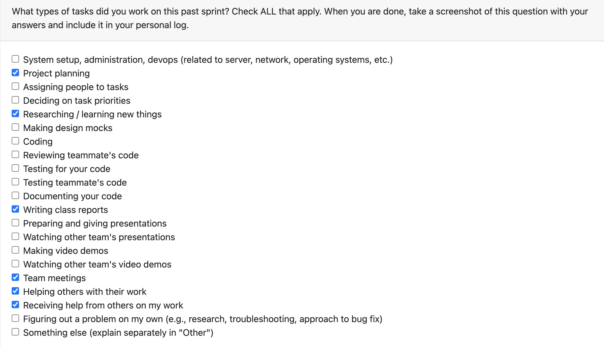

### Which features were yours in the project plan for this milestone?

Our group worked together on the project requirements document for this week. I contributed to the document in the requirements section and contributed ideas to usage sceanrios. Our group collaboratively provided different ideas on the project, usage scenarios, as well as potential requirements and feautures. I also contributed ideas to the architecture of the project, such as how it would be set up, as well as ways of implementation.

Our group also completed the project requirements surveys, and helped each other in the process.

## Log 2:
## Date Range: Weeks 4 - Sep 22-28, 2025

## 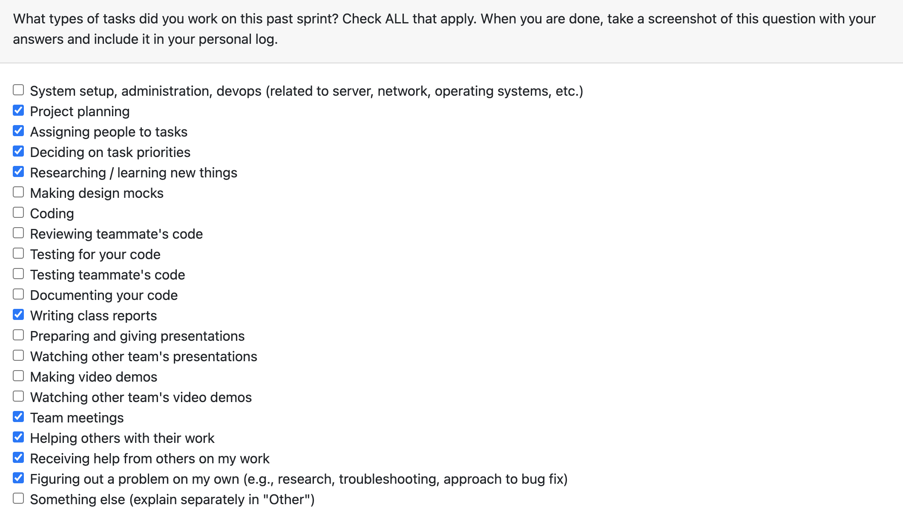

### Which features were yours in the project plan for this milestone?

This week our team worked on the System Architecture Diagram, as well as the project proposal/project plan document. Some features that I contributed to this week was constructing a template for the system architecture digram, and reviewing and adjusting it, following the System Architecture Design Checklist. Some feautures that I contributed to on the Project Proposal document was the project scope, proposed solution, use cases and the test frameworks. Additionally, I contributed to the team log for this week.

## Log 3:
## Date Range: Weeks 5 - Sep 29 - Oct 5, 2025

## 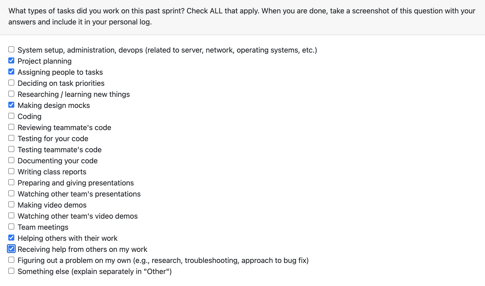

### Which features were yours in the project plan for this milestone?

This week our team worked on the level 0 and level 1 Data Flow diagrams. Some features that I contributed to this week was developing the level 1 data flow diagram. Our team split into 2 subgroups, with one group working on the level 0 data flow diagram and the other working on the level 1 diagram. Our group accidently made 2 level 1 data flow diagrams, so I reviewed both diagrams to spot differences and compare, which allowed me to gain a deeper understanding of components we should change, add, or remove. Additionally, I brought printed copies of the level 1 data flow diagram to class.

## Log 4:
## Date Range: Weeks 6 - Oct 6 - Oct 12, 2025

## 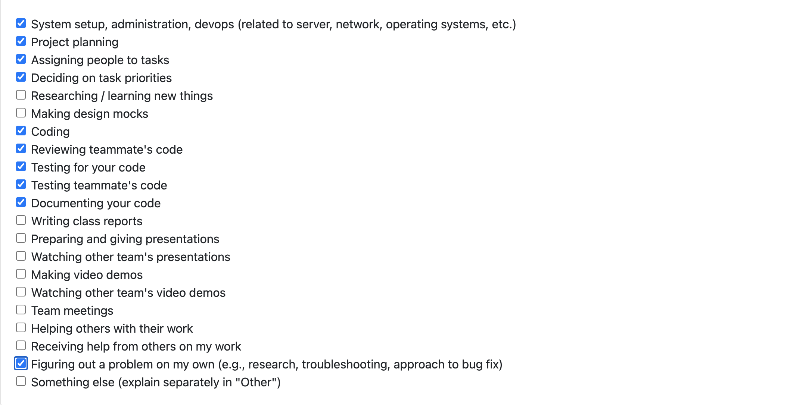

### Which features were yours in the project plan for this milestone?

This week, I worked on deciding on an official tech stack with the rest of my team, incorporating the finalized project requirements. Additionally, I uploaded the data flow diagram and software architecture diagram, as well as the descriptions in our github repository and linked them on the main readMe file, and worked on the team log for this week. My team and I also decided to divide setting up functions for the backend of our project. The python function that I developed requires the user to either allow or deny our system to use external services, such as artificial intelligence/LLM’s to analyze their data. The function starts by prompting the user with a description on why permissions are needed, and then allows the user to either enter “yes” or “no”, on which the system is exited. 

# Log 5:
## Date Range: Weeks 6 - Oct 13 - Oct 19, 2025

## 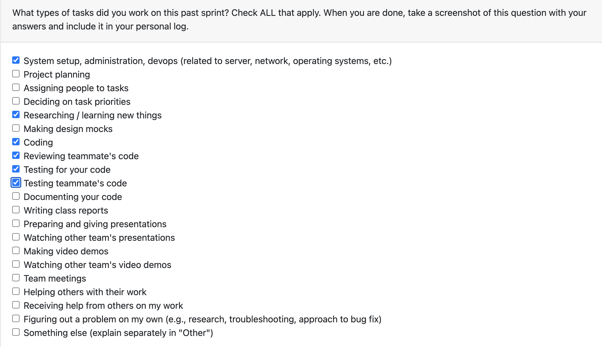

### Which features were yours in the project plan for this milestone?

This week my team and I continued to implement different functions for parts of our system. I worked on coding the function that analyzes a given media project containing graphics, images or other visual digital artifacts, and extracts insights from each of the files in the folder. The function outputs the number of files, top skills such as 3d rendering, photoshop, etc, as well as different softwares that were used. 
I am currently in progress of conducting research on the best ways for our team to implement the database for our system.
For this upcoming week, my focus will be to implement the database for our system to store processed metadata, and files. 

Link to Contribution on Project Board: https://github.com/COSC-499-W2025/capstone-project-team-13/issues/55 

# Log 6:
## Date Range: Weeks 7 - Oct 20 - Oct 26, 2025

## 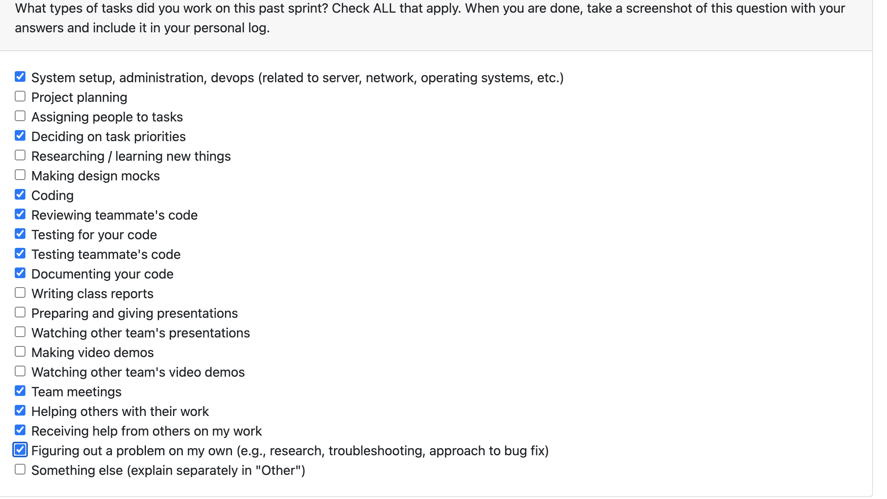

### Which features were yours in the project plan for this milestone?

This week my team and I continued to work on different backend functions of our system. This past week, I worked on researching and implementing a function that would intake coding project folders with files, and somehow, output an ordered list of skills exercised/practiced in their project. The way my function works is by iterating through each file in the given project folder, reading the source code, and analyzing its contents using predefined keyword mappings related to programming languages, frameworks, and technical domains. It then calculates a relevance score for each detected skill, normalizes the results, and returns a structured list ranking the most prominent skills demonstrated in the project.
I also added test cases that test different parts of the function, such as different keywords in different projects, the normalizing scores part of the function, and also iterating through files in a folder. 

Project Board Link to Issue: (https://github.com/COSC-499-W2025/capstone-project-team-13/issues/81)

### In-Progress Tasks

Currently a function that I am working on implementing is a function that takes in a folder of files for a document project, that analyzes the files, and results in a list of skills exercised/practiced in the project. 

### Upcoming cycle

For this upcoming cycle, I plan on completing my function that produces a list of skills for a document project. Additionally, I plan to start working on 1 of 3 more functions that analyzes different project types (media, code, and documents), and produce contribution metrics, depending on whether the projects are a solo vs collaborative projects.

# Log 7:
## Date Range: Weeks 8 - Oct 27 - Nov 2, 2025

## 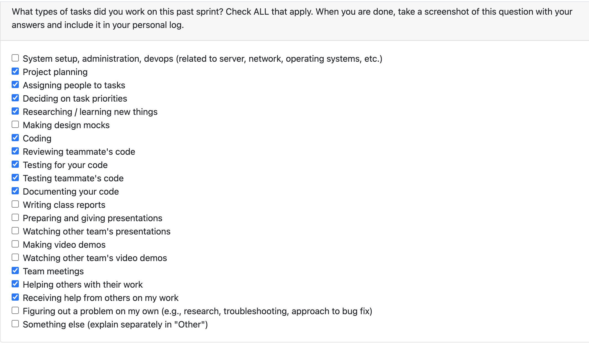

### Which features were yours in the project plan for this milestone?

This week my team and I continued to work on different backend functions of our system, this time focusing on more of the analyses functions for artifact types. This past week, I mainly focused on developing a function that extracts skills from document/word projects. The way my function works is by scaning an entire folder of text-based files, including .txt, .docx, and .pdf, and extracts their content for analysis. Once the text is extracted, the function searches for keywords associated with a comprehensive set of writing skills, such as research writing, creative writing, technical writing, etc. The output of the function is a ranked list of skills along with their occurrence counts, providing a clear picture of the most practiced skills within the analyzed documents. I also added test cases that test different parts of the function, ensuring that the function correctly identifies skills across a variety of document formats and project types. Aside from implementing functions, I also wrote and submitted the team log for this week. 

Project Board Link to Issue: (https://github.com/COSC-499-W2025/capstone-project-team-13/issues/18)

### In-Progress Tasks

Currently, I am working on a function that measures contribution metrics for collaborative projects across different artifact types. This week, I focused on researching various approaches to implement this function effectively, and I plan to complete the implementation this week.

### Upcoming cycle

For this upcoming cycle, I plan to complete implementation of the function that measure contribution metrics for collaborative projects. Additionally, I will work on a function that produces a chronological list of skills exercised for coding, visual media, and document/word projects. Since majority of our systems' functions that manually analyze, extract and output summaries/metrics are nearly complete, I will also start working on functions using LLM's for our system.

# Log 8:
## Date Range: Weeks 8 - Nov 3 - Nov 9, 2025

## 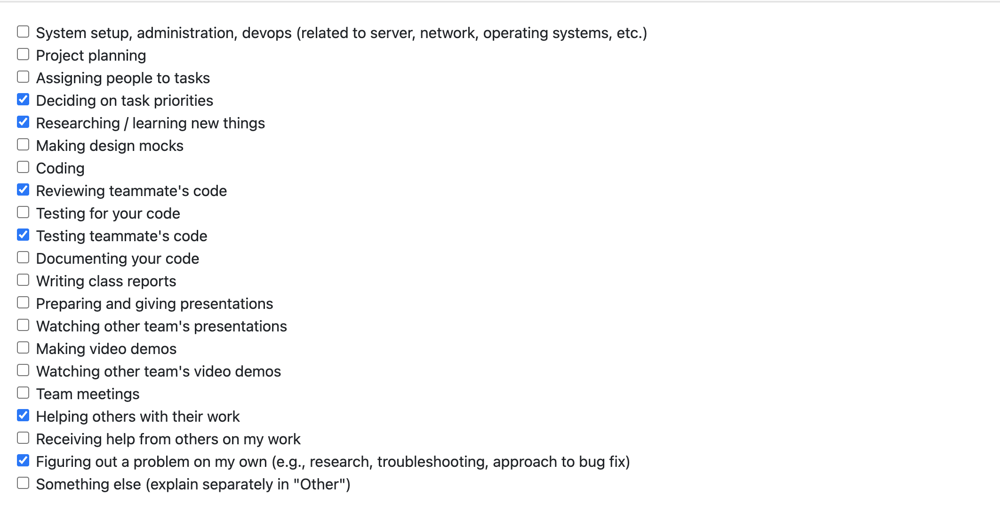

### Which features were yours in the project plan for this milestone?

This week my team continued to work on different backend functions of our system. My goal for this week was to implement/refactor the skills extracting functions for the different artifact types, in order to insert those results from those functions into the database, so that would be the source for producing a chronological list of skills exercised from the users' projects. However, my team members had already refactored those functions to do so. Instead this week, I began implementation of a function that analyzes a text project using AI. Unfortunetly, I was not able to merge my coding contribution for this week, as I had several exams and assignments/project milestones due before the break, and was unable to complete the function in time. However, to compensate, I helped some of my other team members by reviewing/merging their PR's for their functions, and logs.

Project Board Link to Issue: (https://github.com/COSC-499-W2025/capstone-project-team-13/issues/137)

### Upcoming cycle

For the upcoming cycle, I will continue working on my text project analyzer, using ai. After the break, once my function is complete, I plan to shift my focus towards implementing the remaining AI functions of our system, as majority of our manual analyses functions are complete.

# Log 9:
## Date Range: Weeks 12 - Nov 17 - Nov 23, 2025

## 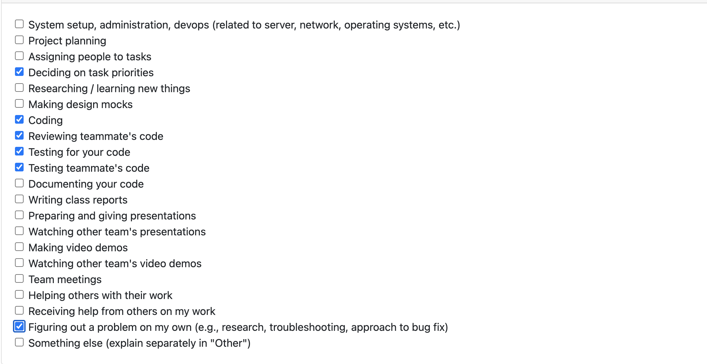

### Which features were yours in the project plan for this milestone?

This week my team continued to work on different backend functions of our system. Prior to the reading break, I began implementation of a function that analyzes a text project using AI. This week, I completed implementation, as well as the required unit tests for the function. I am currently also in the process of writing the manual testing for my function to be accessible and tested through main.py.

Project Board Link to Issue: (https://github.com/COSC-499-W2025/capstone-project-team-13/issues/137)

### Upcoming cycle

For the upcoming cycle, I will begin and complete implementation of a function that analyzes media projects, using AI. 

# Log 10:
## Date Range: Weeks 12 - Nov 24 - Nov 30, 2025

## 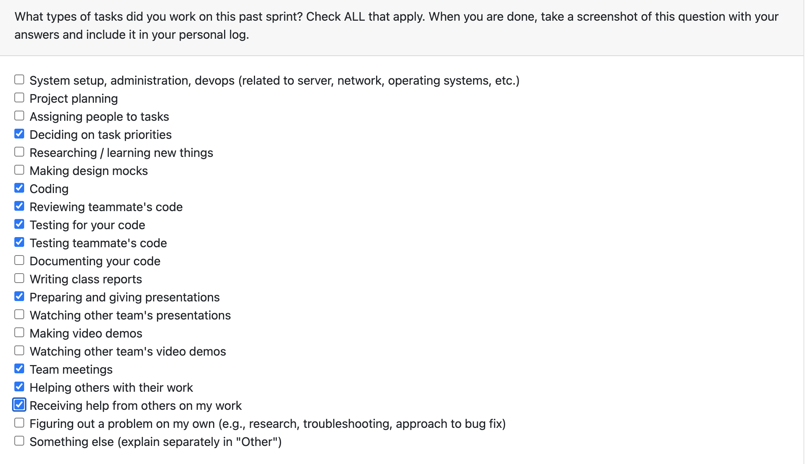

### Which features were yours in the project plan for this milestone?

This week my team and I wrapped up the final implementation of functions and refactored main.py, so that our demo performs as expected. This week, I focused on finishing implementing the last analyses function, which analyzes a media project, using LLM/AI. I also helped my team members refactor some of their functions, as well as went through main.py to ensure that all functions are being called, in the correct order, for the correct project type.

Aside from coding features, I also began working on our presentation slides, focusing on non-LLM skills analysis.

Project Board Link to Issue: (https://github.com/COSC-499-W2025/capstone-project-team-13/issues/140)

## Upcoming Cycle

Despite our backend being pretty much complete, in terms of implementation, my team and I will continue to refactor and make small changes to increase performance, modularity, and uniformity across our system functions.

# Log 11:
## Date Range: Weeks 14 - Dec 1- Dec 7, 2025

## 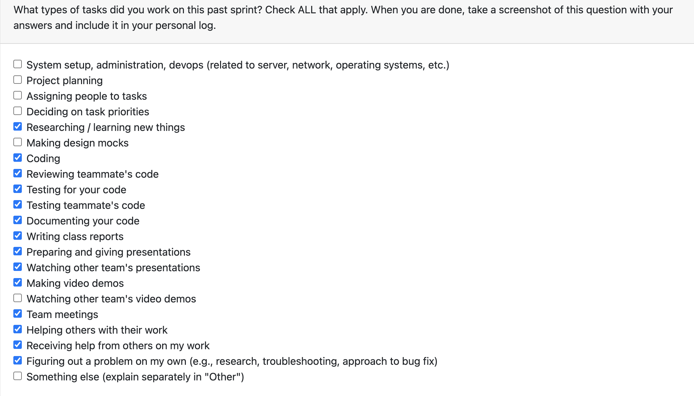

### Which features were yours in the project plan for this milestone?

This week my team and I wrapped up the final implementation of functions and refactored main.py. We encountered a lot of issues for different file types, whether its a folder or file path, so majority of our time this week was spent refactoring and making changes to our existing functions for our milestone 1 submission. Additionally, we also finished the final implementation of our AI features. I dont have any 1 specfic coding function that I worked on this week, but our team met in person and made changes, as a group. Aside from that, half of mine and my groups week was spent preparing for the milestone 1 presentation, as well as writing the team contract.

## Upcoming Cycle

For the following few weeks, I will aim to improve our current system to make it more unique, opposed to just "working" and fulfilling the project requirements. 

## Log 12:
## Date Range: T2 Week 1 - Jan 5 - Jan 11, 2026

## 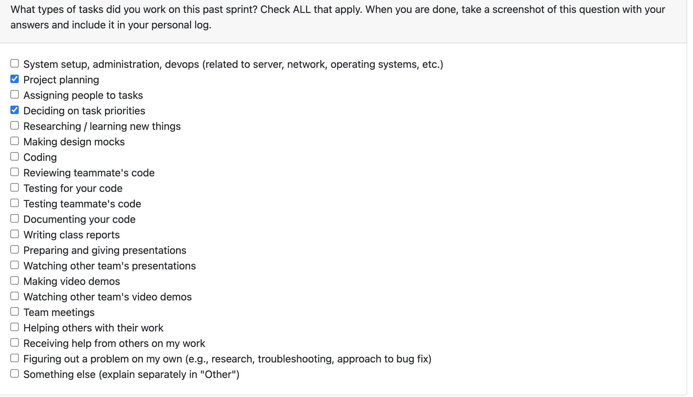

### Which features were yours in the project plan for this milestone?
Over the past week, as well as the winter break, I did not make any coding contributions.

### Upcoming Cycle
For the upcoming cycle, I plan to enhance the skills analysis and identification for the different project types, as well as improve the functionality of our existing functions, as we move towards Milestone 2.