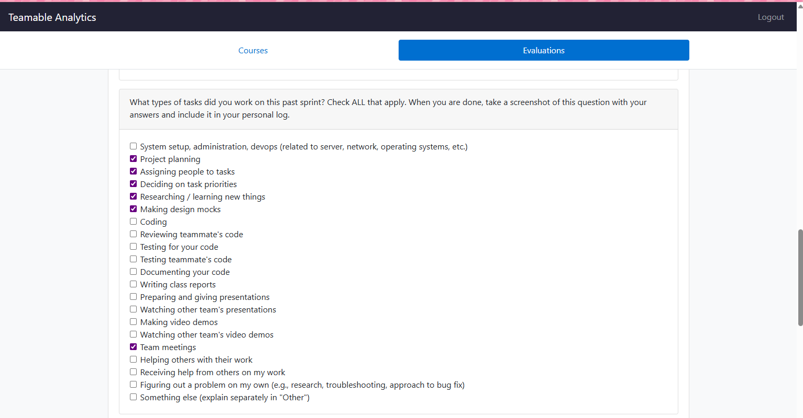
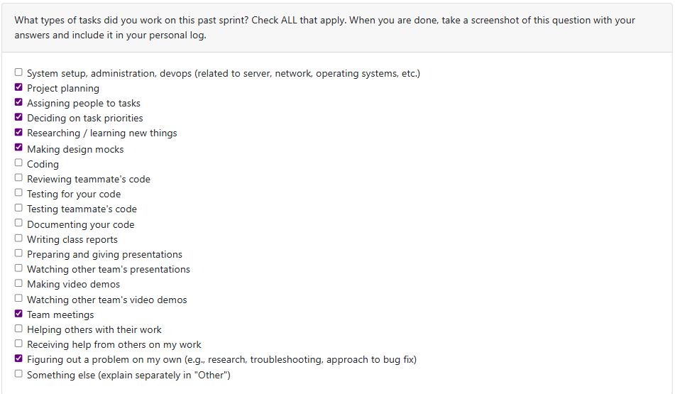
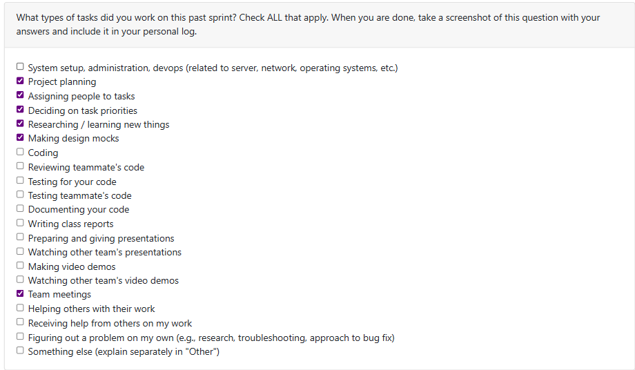
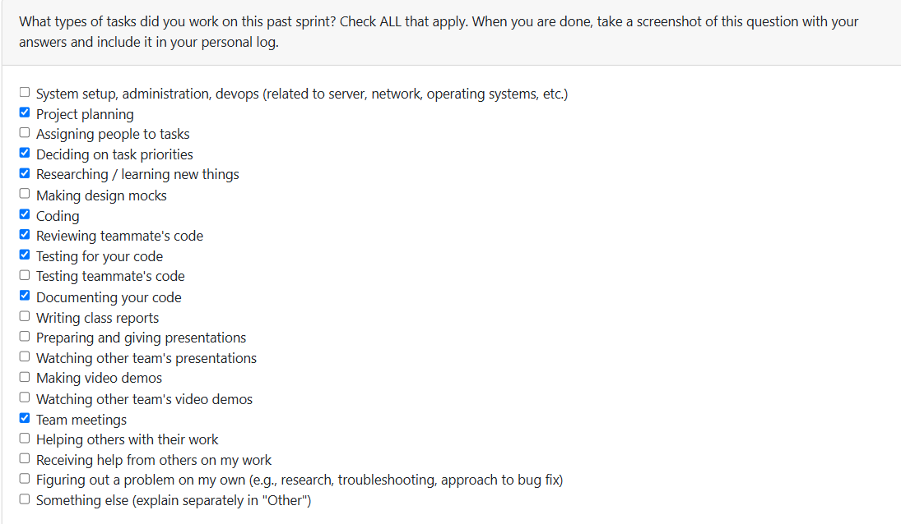

#Week3 (Log 1)

This week, we focused on establishing functional and non-functional requirements for our project. For functional requirements, I proposed that we should create a user dashboard to keep user artifacts and data organized. The requirements I created are as follows: 
Users can view a dashboard summarizing their uploaded artifacts and analytics
 Users can filter artifacts by type, date, creativity score, or productivity score etc. 
Dashboard should show weekly summaries of activity. 

For the non-functional requirements I emphasized that the system should remain secure and reliable. A key to a successful system and earning your user’s trust is having a system that keeps one’s data secure. The requirements I created are as follows: 
Authentication should follow standard practices (encryption, hashed passwords etc.)
 There should be backup mechanisms to prevent data loss/restoration during analysis.

*Tasks Completed / In Progress (Past Two Weeks):*
Contributed to team discussion and documentation for project requirements
Created dashboard functional requirements.
Got feedback from other teams and added useful suggestions to our project layout.
Drafted non-functional requirements for security and reliability.

#Week4 (Log 2)

This week, I focused on the system architecture design and project planning. For the architecture document, I outlined how the system would be separated into layers (UI, business logic, and data) and documented considerations for scalability and performance, such as batch processing and having different file size limits to make data processing managaeable. I also emphasized simplicity and communication, which was reflected in the Figma diagram created for the design.

For the project plan and proposal diagram, I researched suitable tools and technologies. On the frontend, I looked at the functionality and compatability of Electron and React and concluded they would work well for out project because they integrate smoothly with backend services, support cross-platform development, and offer strong testing support.. For testing, I explored frameworks like Jest and Playwright for frontend, backend, and API testing. I also compared  different options such as MongoDB, PostgreSQL and MySQL.  I also compared different options such as MongoDB, PostgreSQL, and MySQL. I concluded PostgreSQL would be the best choice because it offers stronger support for handling complex data types and queries, which is important since our system will need to process and analyze diverse digital artifacts (documents, media, and code) and extract metadata efficiently. PostgreSQL’s robustness works well for generating summaries, highlights, and productivity metrics. And since its syntax is very similar to SQL, which our team is already familiar with, the transition will be smooth. Lastly, I signed up for a set of easy, medium, and hard tasks outlined in our project proposal that I will be completing throughout the course of the project.

*Tasks Completed (Past Week):*

Contributed to the System Architecture Design Document (layers, scalability, communication).
Details from the System Architecure document was smoothly translated into the Figma design document. 
Researched frontend tools (Electron, React).
Researched testing tools (Jest, Playwright).
Compared databases and came to a conclusion on the best fit.
Signed up for easy, medium, and hard tasks in the project proposal.

#Week5 (Log 3)
Date Range: Sept 29 – Oct 5, 2025

This week, I focused primarily on the development and review of our Data Flow Diagrams (DFDs), system architecture refinements, and completing the final touches on our team’s project proposal.

Tasks Worked On:
- Collaborated with the team to build the Level 0 and Level 1 Data Flow Diagrams using Draw.io and Figma.
-Double-checked formal notation and labelling to ensure that all inputs and outputs matched across levels, and referenced with DFD requirements.
- Reviewed other teams’ DFDs during Wednesday’s class session provided feedback and also took some valuable insights. For example, I noted that our diagram explicitly showed distinct data stores and categories (Processed Data, Analytics Stores, Selected Filters), whereas another team focused on roles (e.g., Admin, Project Manager) instead of the actual flow of data. My feedback emphasized that our balanced approach aligned well with the purpose of a DFD — visually summarizing flows without overloading with explanations.
-Supported final revisions of the System Architecture document, ensuring consistency between layers and communication flows.
- Helped complete and submit the team’s project proposal.

Recap of Goals / Progress:
- Features assigned to me this milestone: Contributions to the DFD design and system architecture documentation.
- Project board association: My work connects to tasks like “Submit DFD” (#4) and “Submit team’s project proposal” (#1).
- Progress in last 2 weeks: The proposal task has been completed and submitted. The DFD diagram and reflection has also been successful completed and submitted. Everyone has been co-operating well with one another and has been communicating in a clear and timely manner.

#Week6  (Log 4)
Date Range: Oct 6 – Oct 12, 2025

This week, I worked on implementing and testing the ProjectCollabType function, which determines whether a project is individual or collaborative based on folder and metadata analysis.

Tasks Worked On:
-Created the identify_project_type() function to check contributor and editor information from parsed files.
-Used manual and automated testing to confirm that the function correctly classifies projects in different scenarios (solo projects, group projects, and empty data).
-Adjusted the logic to make sure contributor detection stays accurate even if files have mixed editors.
-Thoroughly reviewed and tested peer's code contributions.

Recap of Goals / Progress:
Feature assigned: Project Collaboration Type Detection.
Project board association: Task #14 – Determine Project Collaboration Classification.

Progress summary: Completed and tested the feature successfully. Future improvements could include linking Git-based contributor data for more precise results.

#Week7 (Log 5)
Date Range: Oct 13 – Oct 19, 2025

This week, I focused on expanding our system’s analysis capabilities and improving the connection between project metadata and contribution insights. My primary tasks involved implementing a new data-processing function for individual contribution analysis, refactoring an existing module to integrate real parsed data, and performing code reviews to ensure system consistency and maintainability.

Tasks Worked On:

- Developed the extrapolate_individual_contributions() function, which estimates contribution percentages for each collaborator based on file ownership, edit history, and line count metrics (Issue #16).
- Refactored the existing identify_project_type() function to use real parsed metadata instead of dummy input, improving accuracy when classifying projects as individual or collaborative (Issue #14).
-Created dedicated unit test files (test_projectcollabtype.py and test_indivcontributions.py) to validate both new and updated functions through multiple scenarios.
-Reviewed teammates’ pull requests to verify code clarity, consistency, and integration across branches.
-Conducted light research on data-driven contribution tracking approaches to better understand how similar systems quantify individual effort.
-Ensured all new code followed team structure conventions, including creating independent test files within the /tests directory and integrating functions with the existing project data pipeline.

Recap of Goals / Progress:

-Feature(s) assigned this milestone: Contribution analysis implementation (extrapolate_individual_contributions()), project type refactor (identify_project_type()), and test coverage expansion.
-Project board association: Tasks related to “Extrapolate Individual Contributions” (#16), “Update Project Collaboration Type Function” (#14), “Write Unit Tests” (#18), general review of teammate pull requests, and completion of team log.
-Progress summary: Both functions have been successfully implemented, tested, and pushed to their respective branches. Each feature aligns with our system’s data processing and analysis pipeline. Team coordination and review cycles remain strong, and the project’s analytical components are becoming increasingly robust and well-integrated.

**#Week 8 Log (Log 6)**
Date Range: October 13 – October 19, 2025

**Tasks Worked On:**
- Implemented summarize_projects() function: Built a new analysis module to extract key project metadata (e.g., time spent, success score, contribution score) and compute a balanced ranking of top projects. The function integrates normalization, weighted scoring, and diversity-aware selection to ensure summaries capture both depth and breadth of skill coverage.
-Connected summarizer to project  database: Integrated the function with the existing database.py schema to automatically pull real project data (from the Project, File, and Contributor tables) and generate summaries without requiring mock data.
-Created test files-
- Reviewed and merged team pull requests: Checked and tested integration of the contribution and project-type analysis to maintain consistency across project.
-Code organization and cleanup: Ensured the new files followed the established structure and consistent standards. Added safeguards and normalization logic to handle edge cases (e.g., missing scores or empty project sets).

**Recap of Goals / Progress**

Feature(s) assigned this milestone:
-Implementation of the project summarization module (summarize_projects)
-Integration of real metadata retrieval from database.py
-Comprehensive testing for al modules
-Reviewed teammate code and merged updates to maintain system coherence.

**Project board association:**
#24  Summarize the top ranked projects

**Progress summary:**
The new summarization component is fully functional and capable of generating high-level insights directly from the database. This marks a key step toward building the system’s automated analytics layer.

**Reflection:**
This week’s work helped bridge the gap between raw project metadata and analytical output. The summarizer not only improves interpretability but also sets the foundation for personalized summaries (e.g., skill diversity or top-performance views). I also reinforced my understanding of how to design modular analysis functions that align with the larger system pipeline.
Next week's tasks will involve creating a function to summarixe projects in chronological order (Issue 26)

# Week 9 Log (Log 7)
Date Range: October 27 – November 2 2025

Tasks Worked On:

Implemented rank_projects_by_date() function: Developed a new module to organize projects in chronological order based on creation and update timestamps. This feature enhances the system’s analytical depth by providing insight into user progress and project evolution.

Integrated with database schema: Connected the ranking function to database.py to pull real project metadata directly from the Project table (using fields like date_created and date_modified). Ensured compatibility with existing database operations and error-handling logic.

Created unit and console-based tests: Built a unit test file (test_project_ranking.py) to verify correct sorting behavior, handling of malformed/missing dates, and consistent formatting of project timelines. Also implemented a manual testing interface in testConsole.py to allow interactive evaluation of the ranking function.

Resolved merge conflicts and maintained compatibility: Addressed conflicts arising from recent refactors and ensured the ranking feature integrated smoothly with other modules such as summarizeProjects, getConsent, and fileFormatCheck.

Debugged import path and module loading issues: Identified and resolved several path inconsistencies that prevented proper import of database and analysis modules during test execution.

During my next sprint, I plan to continue working on this and ensure it integrates smoothly with the summarization and contribution analysis modules, creating a unified and consistent project insights workflow.

# Week 10 Log (Log 8)
Date Range: Nov 3 – Nov 9, 2025

Tasks Worked On:
This week, I focused on improving my ProjectCollabType feature by introducing Git analysis to make project identification more accurate and detailed. The goal was to move beyond simple metadata and use actual Git contributor information to detect collaboration patterns more reliably.

Tasks Worked On:

-Integrated Git-based analysis to read commit histories and contributor usernames directly from project folders.
-Updated the identify_project_type() function to cross-check Git contributors with file metadata for more precise classification.
-Double-checked testing and ensure it still ran smoothly with refactoring.
-Reviewed output accuracy and adjusted logic to handle edge cases where Git data wasn’t available or contributors had overlapping commits.
-Cleaned up and refactored the function for clarity and better modular design before committing the changes.
-Thoroughly reviewed and tested teammates code to ensure precise functionality.

Recap of Goals / Progress:
Feature focus: Project Collaboration Type Detection with Git Integration.
Project board association: Task #14

Progress summary: Successfully extended the function to include Git-based data. The feature now provides deeper and more reliable insight into whether a project is individual or collaborative, aligning with the milestone goal of analyzing work artifacts beyond surface-level metadata.

# Week 11 Log (Log 10)
Date Range: Nov 16 – Nov 23, 2025

Tasks Worked On:

This week, I continued strengthening the ProjectCollabType feature by refining and expanding the Git-based analysis logic. I improved the integration of commit history parsing and contributor extraction, ensuring the feature produces more accurate collaboration classifications. I also updated the corresponding test suite to reflect the new logic and verified that all tests passed after the refactor. In addition, I added the required dependencies for Git analysis to the project’s requirements.txt file to ensure consistent setup across the team. Finally, I spent time reviewing and running my teammate’s resume-bullet generator code and test file to confirm functionality and integration compatibility.

Recap of Goals / Progress:

Feature focus: Project Collaboration Type Detection (Git Integration)
Project board association: Task #14

Progress summary:
This week, I refined the Git analysis functionality by improving contributor parsing, updating the classification logic, and ensuring test coverage aligned with the new behavior. I also ensured proper project setup by updating dependencies and validated teammate code through manual testing. The feature is now more stable, more accurate, and better integrated into the overall pipeline, continuing to push our artifact-analysis system beyond surface-level metadata.

