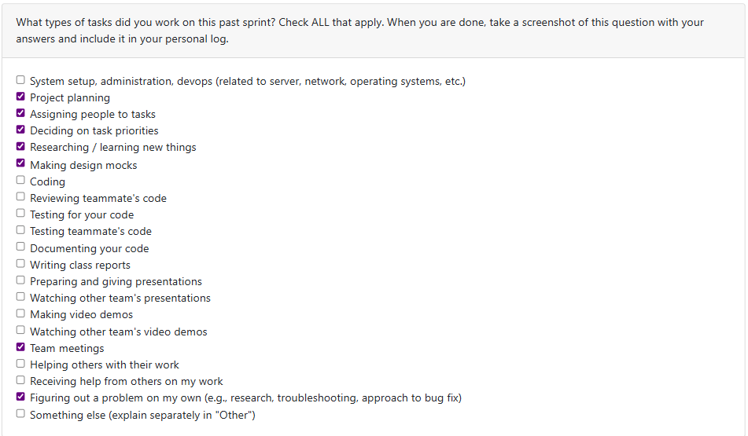

# Week 3 (Log 1)

This week, we focused on establishing functional and non-functional requirements for our project. For functional requirements, I proposed that we should create a user dashboard to keep user artifacts and data organized. The requirements I created are as follows:  
- Users can view a dashboard summarizing their uploaded artifacts and analytics  
- Users can filter artifacts by type, date, creativity score, or productivity score etc.  
- Dashboard should show weekly summaries of activity.  

For the non-functional requirements I emphasized that the system should remain secure and reliable. A key to a successful system and earning your user’s trust is having a system that keeps one’s data secure. The requirements I created are as follows:  
- Authentication should follow standard practices (encryption, hashed passwords etc.)  
- There should be backup mechanisms to prevent data loss/restoration during analysis.  

*Tasks Completed / In Progress (Past Two Weeks):*  
- Contributed to team discussion and documentation for project requirements  
- Created dashboard functional requirements  
- Got feedback from other teams and added useful suggestions to our project layout  
- Drafted non-functional requirements for security and reliability
- 

---

# Week 4 (Log 2)

This week, I focused on the system architecture design and project planning. For the architecture document, I outlined how the system would be separated into layers (UI, business logic, and data) and documented considerations for scalability and performance, such as batch processing and having different file size limits to make data processing manageable. I also emphasized simplicity and communication, which was reflected in the Figma diagram created for the design.  

For the project plan and proposal diagram, I researched suitable tools and technologies. On the frontend, I looked at the functionality and compatibility of Electron and React and concluded they would work well for our project because they integrate smoothly with backend services, support cross-platform development, and offer strong testing support. For testing, I explored frameworks like Jest and Playwright for frontend, backend, and API testing. I also compared different options such as MongoDB, PostgreSQL, and MySQL. I concluded PostgreSQL would be the best choice because it offers stronger support for handling complex data types and queries, which is important since our system will need to process and analyze diverse digital artifacts (documents, media, and code) and extract metadata efficiently. PostgreSQL’s robustness works well for generating summaries, highlights, and productivity metrics. And since its syntax is very similar to SQL, which our team is already familiar with, the transition will be smooth. Lastly, I signed up for a set of easy, medium, and hard tasks outlined in our project proposal that I will be completing throughout the course of the project.  

*Tasks Completed (Past Week):*  
- Contributed to the System Architecture Design Document (layers, scalability, communication)  
- Details from the System Architecture document were smoothly translated into the Figma design document  
- Researched frontend tools (Electron, React)  
- Researched testing tools (Jest, Playwright)  
- Compared databases and came to a conclusion on the best fit  
- Signed up for easy, medium, and hard tasks in the project proposal  

