# Team Logs

## Term 2 Logs
- [T2 Week 3](#term-2-week-3-team-log)

## Weeks 3 - Sept 15-21, 2025
The features included in this milestone were to work together as a group, setting up necessary documentation such as google drive folder, setting up our capstone repository to work on our individual and team logs, working on our project requirements, and creating a project backlog within our repository. Due to the early stages of the project, the rest is unable to be done at the moment. 

Usernames -> Names

JacksonWilson99 -> Jackson Wilson
MayaKnu7 -> Maya Knutsvig
T’Olu Akinwande -> T’Olu Akinwande 
illinai -> Illina Islam
prinamehta -> Prina Mehta
sshah-git -> Sana Shah

## Project board

## Week 4 - Sept 22-28, 2025
The features for this week’s milestone was to revisit our project requirements, and construct our software architecture diagram. Collectively, each of our team members contributed to refining the requirements for our project, as well as discussing and suggesting ideas for the different components in our system architecture diagram. Additionally, our team worked on our project proposal/project plan document, in which we specified our tech stack, functional requirements, and assigned tasks to each of our team members. 

## Week 5 - Sept 29 - Oct 5, 2025
T'olu Akinwande - DFD level 0, Sept 29 - Oct 5

Jackson Wilson - DFD Level 0, Sept 29 - Oct 5

Maya Knutsvig - DFD Level 0, Sept 29 - Oct 5

Prina Mehta - - DFD Level 1, Sept 29 - Oct 5

Illina Islam - DFD Level 1, Sept 29 - Oct 5

Sana Shah - DFD Level 1, Sept 29 - Oct 5

This week, our team revisited the project requirements and worked on developing our Data Flow Diagram (DFD) as part of clarifying the system design. We collaborated on refining the components, discussing how data, processes, and flows would be represented in the diagram. 

## Week 6 - Oct 6 - Oct 12, 2025

GitHub Usernames:

JacksonWilson99 -> Jackson Wilson, 
MayaKnu7 -> Maya Knutsvig, 
T’Olu Akinwande -> T’Olu Akinwande , 
illinai -> Illina Islam, 
prinamehta -> Prina Mehta, 
sshah-git -> Sana Shah

This week, our team revised and made changes to our system architecture diagram, and data flow diagrams, reflecting the finalized project requirements. We also divided up the first few functions of our backend that we needed to implement, and assigned them to each of our team members, as well as updated our github repository. Some functions that our team started developing are checking file formats, distinguishing individual projects from collaborative projects, adding permissions to collect and analyze the users data, as well as permissions to use external services for analysis. Our team also worked on developing a “testConsole” skeleton to test our functions.

Project Board: 

## Week 7 Team Log  
**Date Range:** Oct 13 – Oct 19, 2025  

| Team Member | Work Completed / Focus This Week | Related Issue # |
|--------------|----------------------------------|-----------------|
| **T’Olu Akinwande** | Developed and tested the `extrapolate_individual_contributions()` function to estimate member contribution percentages across parsed projects (issue #16). Also revised the `projectCollabType` function (issue #14) to replace dummy data with real metadata fields and reviewed PRs for alignment and code consistency. | #14, #16 |
| **Prina Mehta** | Implemented file-path input and parsing pipeline so the system automatically reads and processes CSV, JSON, TXT, PY, and ZIP formats. Enhanced directory-crawler logic for multi-file projects. | #2 |
| **Maya Knutsvig** | Completed framework/language identifier module to detect project type based on codebase structure (e.g., Python vs web). Integrated detection with the file-parser output. | #8 |
| **Jackson Wilson** | Built RAKE-based keyword extraction system for text files to summarize important phrases and skills. Updated `testConsole.py` for manual testing and added sample data for validation. | #52 |
| **Illina Islam** | Implemented `projects` database schema for storing project and metadata entries using SQLAlchemy. Updated `README.md` and began connecting database to processing pipeline. | #13 |
| **Sana Shah** | Created `visualMediaAnalyzer` function to scan media files and infer which design software was used, mapping outputs to associated skills. Initial implementation complete (no AI integration yet). | #54 |

---

Burnup Chart:

In-Progress Tasks: 

Completed Tasks:

# Test Report
All tests were written in Python and executed successfully.  
Unit tests were created for each major function (e.g., `extrapolate_individual_contributions()`, `fileParser`, `projectCollabType`).  
Manual testing through `testConsole.py` also confirmed that all modules work as expected with sample project data.

### Reflection Points
**What went well:**  
- The new modular approach helped integrate multiple features smoothly.  
- Each member worked independently on key components that connected successfully during testing.  
- Collaboration during PR reviews improved overall code consistency.  

**What didn’t go as planned:**  
- Merge conflicts across multiple branches slowed integration.  
- The database still isn’t fully connected to other system components.  
- Some manual testing processes (like the console dashboard) remain time-intensive.

  

## Week 12 Team Log  

Project Board:

**Date Range:** Nov 23 - Nov 30, 2025  
**Team Member** | **Work Completed / Focus This Week** | **Related Issue #** |
|------------------|--------------------------------------|---------------------|
| **T’Olu Akinwande** | Improved Git-based collaboration detection and integrated fixes into ProjectCollabType. Developed the new **AI Project Ranking** feature, added scoring logic, semantic/skill-based evaluation, and created a full test suite and clean PR. | #14, #114 |
| **Prina Mehta** | Worked on the **deletion module**, adding safe deletion of AI-generated insights, shared-file detection, protection rules, and clearer warnings/previews. Also prepared for next week’s Milestone 1 presentation. | #25 |
| **Maya Knutsvig** | Added **textDocumentScanner** and **visualMediaAnalyzer** to `main.py` (they were previously unused). Updated scanners to use file-format and file-data checking for more reliable processing. |  |
| **Jackson Wilson** | Developed **code efficiency analysis** (time/space complexity grading). Added project-sorting to main and included missing dependencies in `requirements.txt`. |  |
| **Illina Islam** | Improved resume-bullet generation functions and built the new submenu for resume item generation, refining formatting and usability. | #22, #112, #166 |
| **Sana Shah** | Built the **AI media-project analyzer** for design/media files and integrated early logic for skill inference from visual artifacts. | #140 |

Burnup Chart:

In-Progress Tasks: 

Completed Tasks:

#Test Report 

271 our of 274 test cases throughtout the project are functioning successfully. The 3 test cases with errors are currently undergoing refacroring and will continue to be worked on in the upcoming week. Other than those 3, everything else is being tested accurately and efficiently.

# Reflection Points
# What went well:

-New features such as the AI Project Ranking system, improved media analysis, resume-bullet generation updates, and the deletion safety module all integrated smoothly into the existing workflow.
-Unit tests and manual testing confirmed strong reliability across modules, and team communication during PR reviews helped maintain consistency.

# What didn’t go as planned:

-A few merge conflicts came up while integrating multiple new components, but they were resolved quickly.
-Some modules required extra manual testing time due to new AI-related setup steps, but everything was stabilized by the end of the week.

## Week 8 Team Log  
**Date Range:** Oct 20 – Oct 26, 2025  

| Team Member | Work Completed / Focus This Week | Related Issue # |
|--------------|----------------------------------|-----------------|
| **T'Olu Akinwande** | Implemented summarize_projects.py function + required tests | # 24 |
| **Prina Mehta** | Major database refractor + required tests | # 13 |
| **Maya Knutsvig** | Added sniffer for codeIdentifier + thorough testing | # 8.2 |
| **Jackson Wilson** | Expanded on comment keyword functionality | # 12.2 |
| **Illina Islam** | Implemented codingProjectScanner.py + required tests | # 13 |
| **Sana Shah** | Implemented skillsExtractCoding.py + required tests | # 81 |

---

Burnup Chart:

In-Progress Tasks:

Completed Tasks:

# Test Report
All tests were written in Python and executed successfully when they were written. At the moment some of our old tests don't run due to our repository clean up. We will make sure to fix these problems by next week. The errors mainly generate because of the changed file paths.
Manual testing can be done through `testConsole.py` and it confirms that all modules work as expected with sample project data.

### Reflection Points

**What went well:**  
- During our meeting this week we decided to clean up our repository
  - organized our functions and classes under category folders
- Team members worked independantly
- Lots of ideas were shared and agreed upon over the week

**What didn't go as planned:**  
- Our older tests don't run due to repo clean up
  - file paths have changed so they needed to be updated in the older test folders

  ## Week 9 Team Log  
**Date Range:** Oct 27 – Nov 2, 2025  

| Team Member | Work Completed / Focus This Week | Related Issue # |
|--------------|----------------------------------|-----------------|
| **T'Olu Akinwande** | Implemented rank_projects_by_date.py + required tests | # 26 |
| **Prina Mehta** | Implemented ai_service.py + required tests | # 21 |
| **Maya Knutsvig** | Implemented textDocumentScanner.py + required tests| # 13 |
| **Jackson Wilson** | Implemented test_comprehension_score.py | # 100 |
| **Illina Islam** | Implemented mediaProjectScanner.py + required tests | # 13 |
| **Sana Shah** | Implemented skillsExtractDocs.py + required tests | # 18 |

---
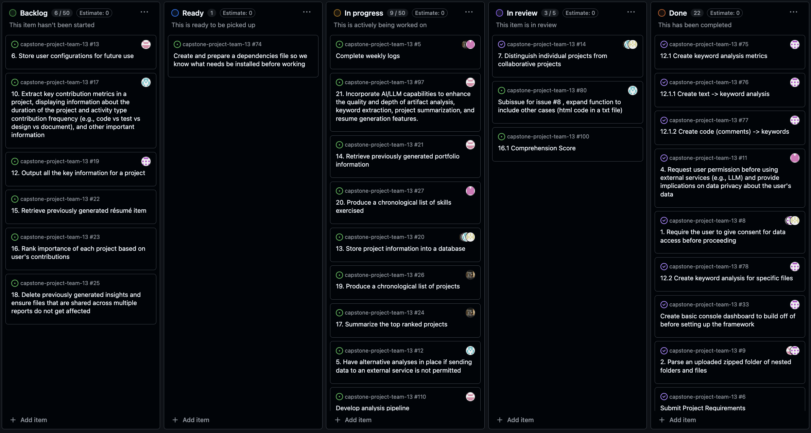

Burnup Chart:
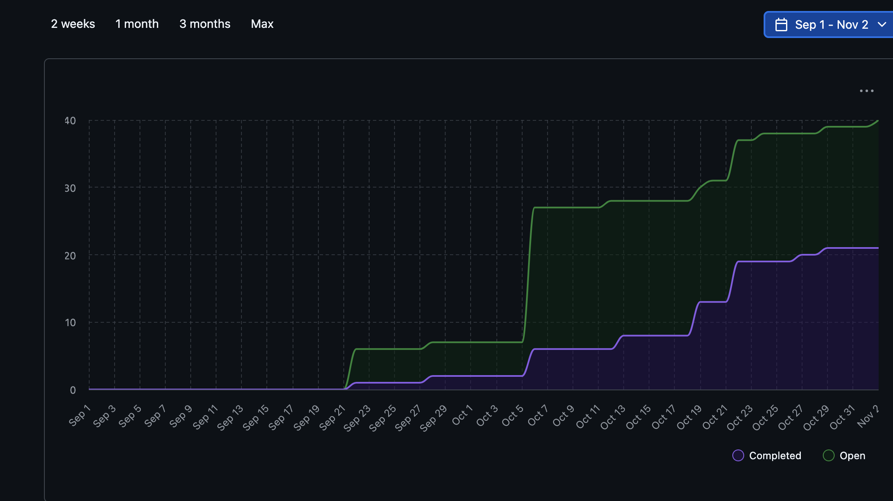

In Progress Tasks:
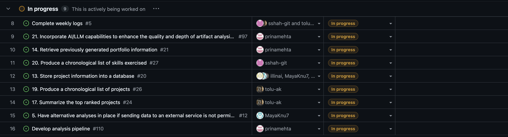

Completed Tasks:
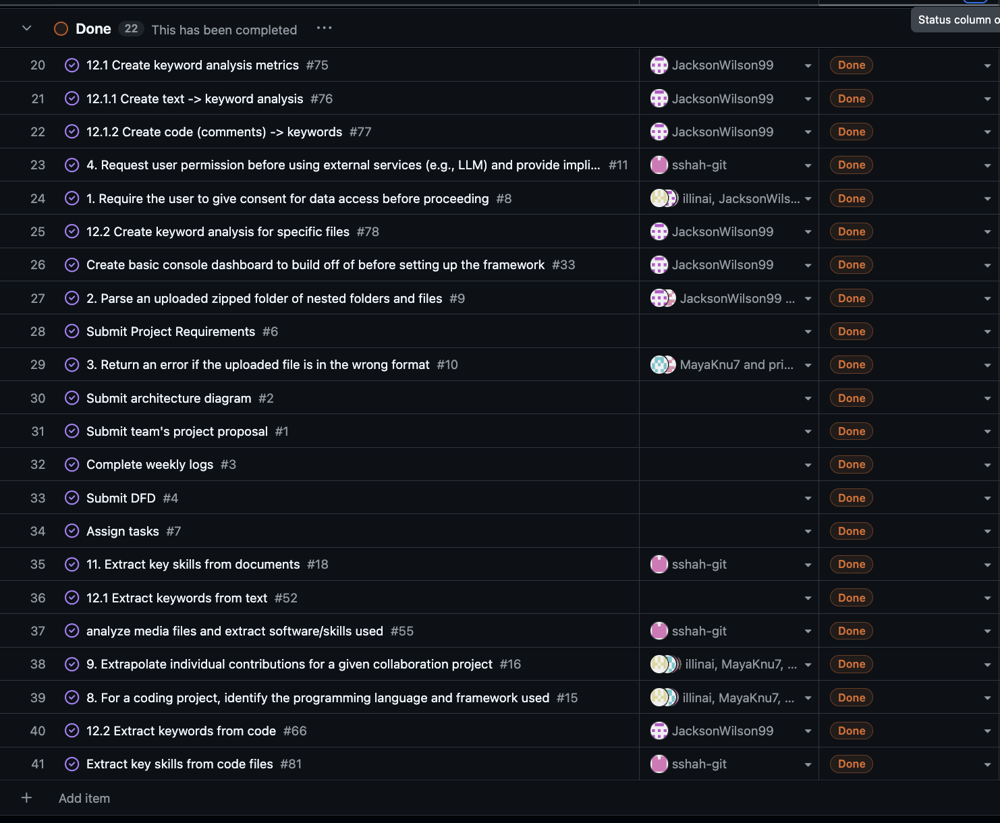

# Test Report
All tests were written in Python and executed successfully when they were written. This week, during our meeting, we decided to automate our unit testing, so we had to refactor some test files that were made prior to this week.
Manual testing can be done through `testConsole.py` and it confirms that all modules work as expected with sample project data.

### Reflection Points

**What went well:**  
- During our team meeting this week, all team members, collectively revised our systems pipeline, in order to clarify and review progress on our functions, and the system as a whole. This allowed us to proritize which functions needed to be implemented first, moving forward.
- Team members worked independently on different functions of the system.
- Lots of ideas were shared and agreed upon over the week, collectively.

**What didn't go as planned:**  
- Our team decided that it would be more efficient for us to automate tests for our functions, so some of our older test files had to be refactored. 

#Week 10 Team Log 
**Date Range:** Nov 2 – Nov 9, 2025  
### Team Progress Log — Week of Nov 3 – Nov 9, 2025

| **Team Member** | **Work Completed / Focus This Week** | **Related Issue #** |
|------------------|--------------------------------------|---------------------|
| **T’Olu Akinwande** | Improved the ProjectCollabType feature by adding Git-based contributor analysis and testing it for accuracy. | #18 |
| **Prina Mehta** | Implemented new AI features, including the **Project Analyzer** for technical project evaluation. | #111, #112, #113 |
| **Maya Knutsvig** | Combined existing text analysis functions into one unified **TextScanner** workflow. | #20 |
| **Jackson Wilson** | Standardized tests under **unittest** and finalized the **comprehension score** feature. |#74|
| **Illina Islam** | Updated **config.py** to support more file types in **fileFormatCheck.py**. | |
| **Sana Shah** | Started implementing an **AI-based text project analysis** function and supported teammates with PR reviews. |#137|

#Burnup Chart:

#In-Progress Tasks:

#Completed Tasks:

**Test Report**
All tests were written in Python and executed successfully. All unit testing is automated. Manual testing can be done through testConsole.py and is good for any debugging that may be reqwuired in the future.

**Reflection Points:**

**What went well:**  
- The team collaborated effectively and made steady progress in multiple areas, including AI integration, database expansion, and analysis module refinement.  
- Testing across different features showed consistent outputs, confirming smooth communication between modules.  
- Collaboration and code reviews helped maintain a unified structure across all functions.

**What didn’t go as planned:**  
- Some minor test import path issues occurred when switching branches - we just need to keep activitely updating the dependcies document so we know what to install before running our files to avoid errors. 
- Running all project tests together took longer than expected, as some modules required large sample data to validate.

---

## Week 12 Team Log  
**Date Range:** Nov 17 – Nov 23, 2025  

| Team Member | Work Completed / Focus This Week | Related Issue # |
|--------------|----------------------------------|-----------------|
| **T'Olu Akinwande** | Updated projectcollabtype.py + required tests | # 14 |
| **Prina Mehta** | Expanded/reconfigured user_config.py + config_integration.py + required tests  | # 13 |
| **Maya Knutsvig** | Expanded/reconfigured summarizeProjects.py + related database functions + fileParser.py| # 17 |
| **Jackson Wilson** | Implemented importanceRanking.py + importantScores.py + required tests| # 23 |
| **Illina Islam** | Implemented resumeBulletGenerator.py + required tests | # 112 |
| **Sana Shah** | Implemented ai_text_project_analyzer.py + required tests | # 137 |

---
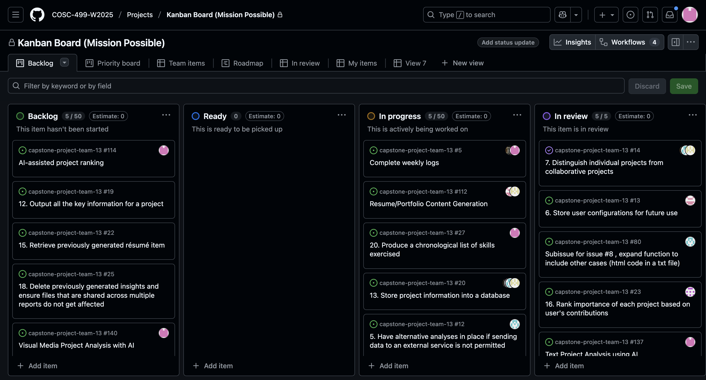

Burnup Chart:

In Progress Tasks:
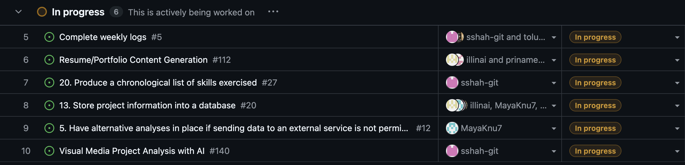

Completed Tasks:
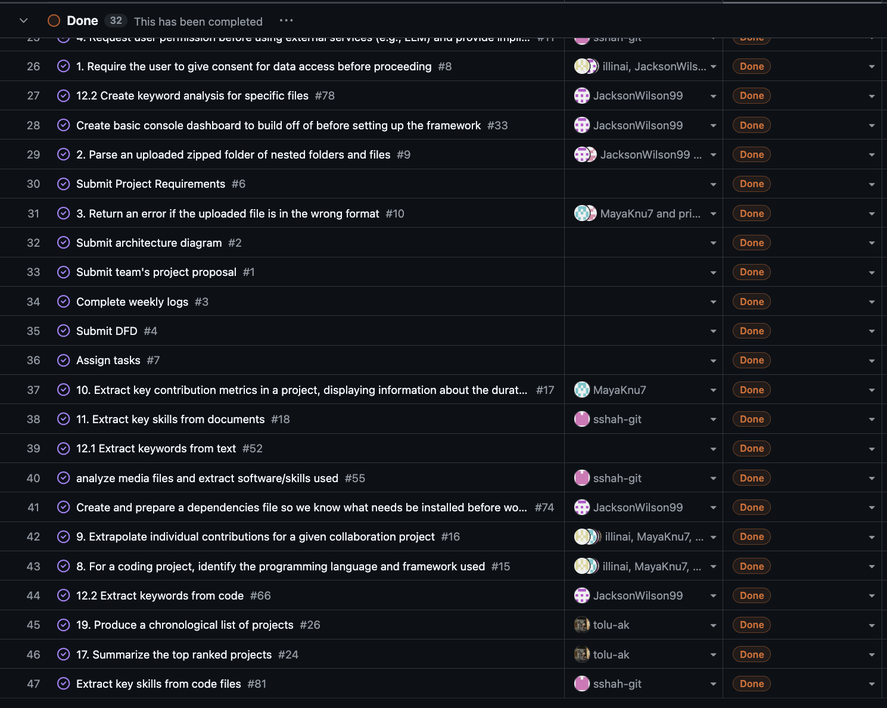

# Test Report
All tests were written in Python and executed successfully when they were written. For each of the functions of our system, we have implemented unit tests. Manual testing can be done through `testConsole.py` and it confirms that all modules work as expected with sample project data.

### Reflection Points

**What went well:**  
- The team collaborated effectively and made steady progress in multiple areas, including our final few manual analysis and extraction functions, AI integration, and updating/refactoring existing functions.
- Testing across different features showed consistent outputs, confirming smooth communication between modules.  
- Team members worked independently on different functions of the system.

**What didn't go as planned:**  
- Due to this week being our first week back from the break, we weren't able to hold a team meeting due to conflicting schedules. 

## Week 14 Team Log  
**Date Range:** Dec 1 – Dec 7, 2025  

| Team Member | Work Completed / Focus This Week | Related Issue # |
|--------------|----------------------------------|-----------------|
| **T'Olu Akinwande** | Implemented AI_project_ranker.py + required tests | # 114 |
| **Prina Mehta** | Refactored Main.py to ensure it runs as expected  | # 160 |
| **Maya Knutsvig** | Refactored Main.py to ensure it runs as expected | # 160 |
| **Jackson Wilson** | Refactored Main.py to ensure it runs as expected | # 160 |
| **Illina Islam** | Refactored Main.py to ensure it runs as expected  | # 160 |
| **Sana Shah** |Refactored Main.py to ensure it runs as expected  | # 160 |

---
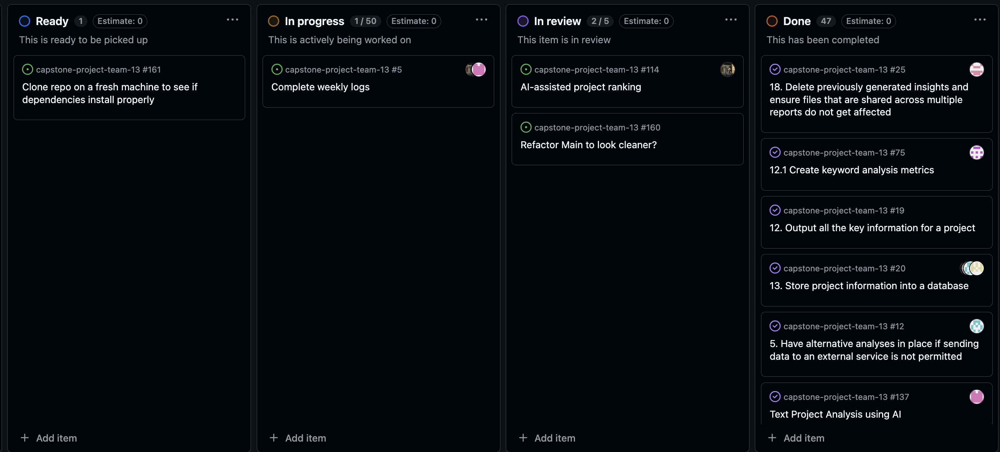

Burnup Chart:
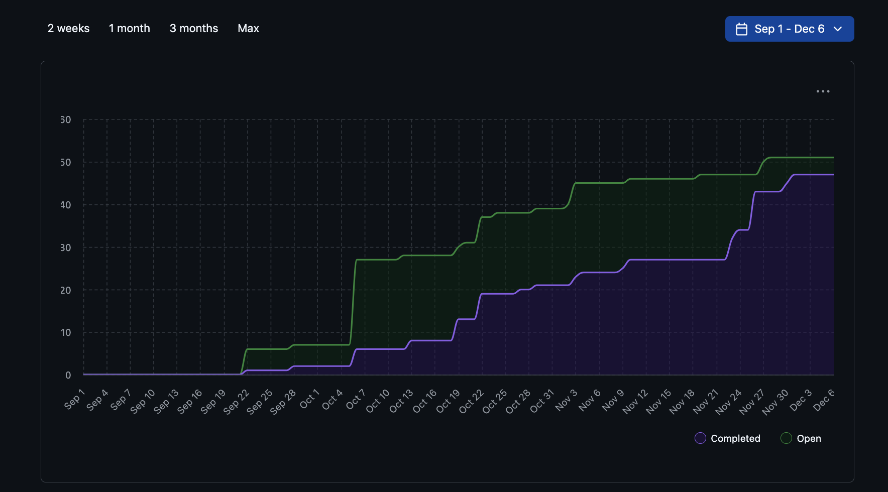

In Progress Tasks:
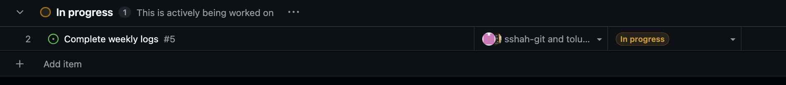

Completed Tasks:
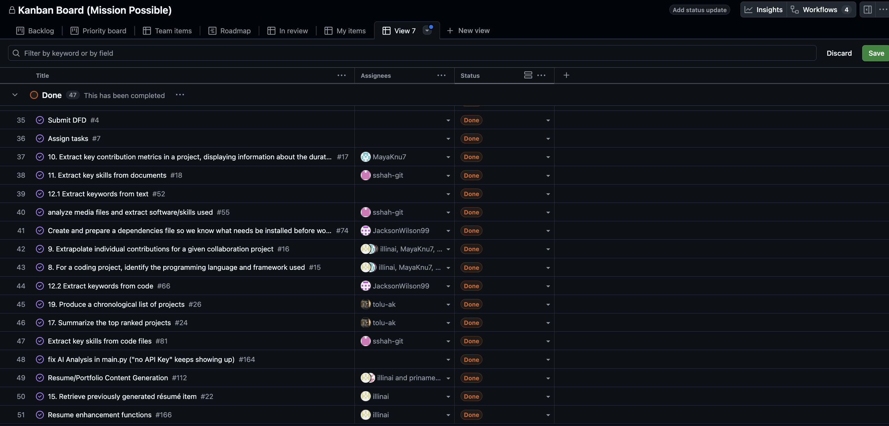

# Test Report
All tests were written in Python and executed successfully, other than analysis using LLM which is currently not working due to API key generation, but we are currently working on resolving it. For each of the functions in our system, we have implemented unit tests. Manual testing can be done through `main.py` and it confirms that all modules work as expected with sample project data, after refactoring

### Reflection Points

**What went well:**  
- The team collaborated effectively and made progress with the last few function implementations, and refactoring existing functions.
- Team members worked independently and collaboritvely, to refactor main.py.

**What didn't go as planned:**  
- Some of our inputs for different project types were not uniform through the system, so we had to refactor some existing functions, as well as main.py, to ensure that they accept intended file types, and analyzes them accordingly, for each project/digitalartifact type.

## Term 2 Week 3 Team Log  
**Date Range:** Jan 19-Jan 25, 2026  

| Team Member | Work Completed / Focus This Week | Related Issue # |
|--------------|----------------------------------|-----------------|
| **T'Olu Akinwande** | Improving skills extraction | # 244 |
| **Prina Mehta** | Incremental file upload support, duplicate file detection, silent skipping of pre-existing files  | # 219 & 220 |
| **Maya Knutsvig** | Created portfolio formatter | # 227 |
| **Jackson Wilson** | Implemented github contribution extraction, created role assignment function | # 222 & 256 |
| **Illina Islam** | Thumbnail upload, created a resume generator   | # 237 & 224 |
| **Sana Shah** | Project representation module  | # 263 |

---
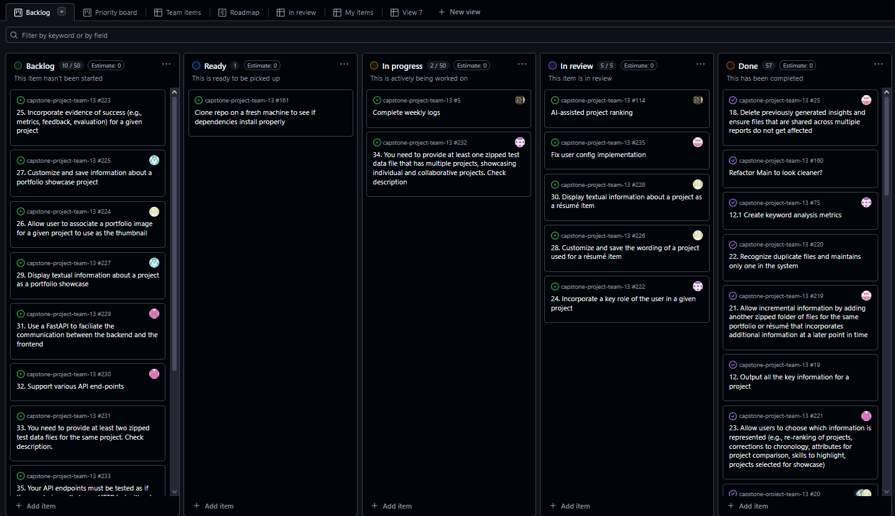

Burnup Chart:
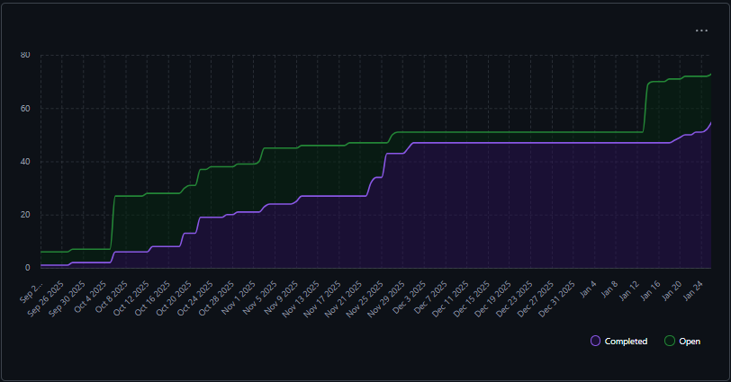

In Progress Tasks:
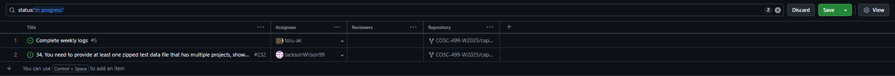

Completed Tasks:
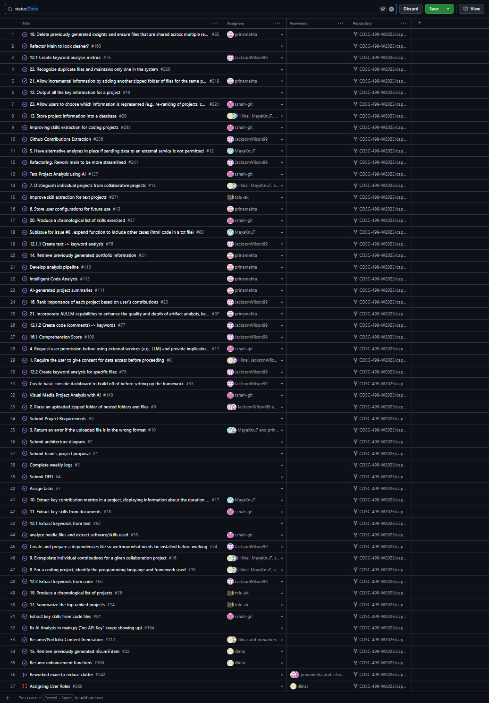

# Test Report
All tests were written in Python and executed successfully, other than analysis using LLM which is currently not working due to API key generation, but we are currently working on resolving it. For each of the functions in our system, we have implemented unit tests. Manual testing can be done through `main.py` and it confirms that all modules work as expected with sample project data, after refactoring

### Reflection Points

**What went well:**  
- The team did well tacking as much of the M2 requirements as we could within the week
- We met and reworked a schedule for meetings that works better for term 2

**What didn't go as planned:**  
- because we didn't have the above meeting, our work the previous week was a little disorganized until we met about it.